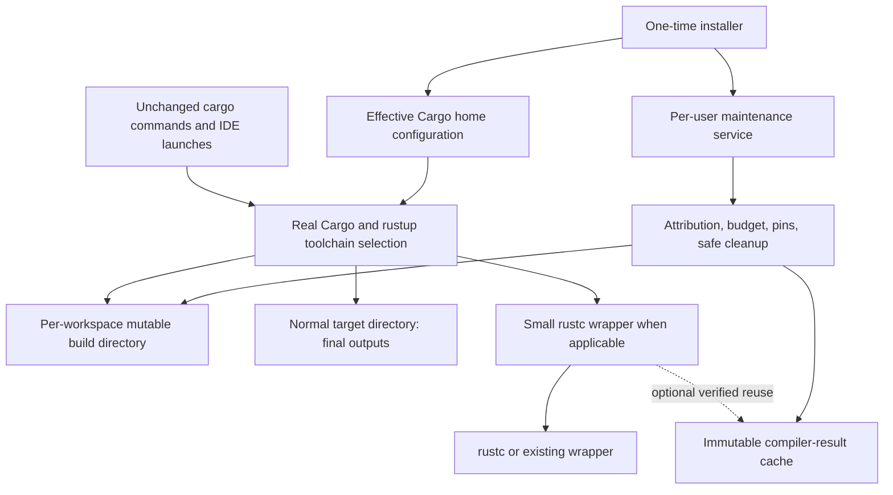

# Plan: install rgo once, keep using Cargo

**Date:** 2026-09-28. **Status:** accepted implementation checklist; work is in progress.
**Baseline:** `838fb22`. **Evidence:** [research and reproduced findings](installation-storage-research.md).

This is the current delivery checklist under `PLAN.md`; its earlier release-readiness claims must be read with the newly identified blockers. Checked items below mean that evidence is complete; unchecked items remain work, even where a partial implementation exists.

## 1. Product decision

Use Cargo's configuration as the default integration. A single installation command installs a matched pair of executables, activates managed intermediate storage, starts maintenance, and verifies the result. Users keep their ordinary commands:

```text
cargo build
cargo run
cargo test
cargo check
cargo clippy
cargo +nightly build
```

The product promise is: **Rust's reusable build storage is managed for the user; active builds remain safe; ordinary Cargo workflows retain their expected behavior.** Intermediate storage is reclaimed under a documented budget policy. Final binaries and other requested outputs remain where Cargo normally places them.

### Proposed decisions to approve together

| Decision | Recommendation |
|---|---|
| Integration | Native Cargo configuration remains the relocation pilot. A separately owned Unix PATH launcher is the supervised candidate for safe automatic GC; neither mode is ready for unattended cleanup. |
| Initial value | Automatic management of intermediate disk storage, with accurate explanations when cleanup cannot meet the budget. |
| Supported runtime | Cargo 1.91+ for relocation, with a separately tested capability matrix for safe GC. Older toolchains are reported as unmanaged. |
| First distribution | Verified prebuilt bundles with install-and-activate entry points for macOS/Linux and Windows; source install as a secondary route. |
| Mutable state | One isolated Cargo build directory per workspace identity; no global shared mutable target tree. |
| Shared cache | Experimental/off by default until the reproduced wrong hit, input-identity audit, lifecycle, and benchmark gates pass. |
| Existing targets | Detect and preview old intermediates; deletion is a separate explicit migration action. |
| RAM | Measure it, but do not claim a hard compiler-memory limit in the storage release. |
| Upstream | Track Cargo's shared cache and GC; prefer integrating stable upstream capabilities when they meet the requirements. |

No global changes to debug information, incremental compilation, compiler job counts, or source remapping are included in the default experience. These affect the development workflow and require separate opt-in policies.

## 2. Architecture and responsibilities



Cargo continues to own dependency resolution, downloads, build scheduling, fingerprints, and output selection. rgo owns its install state, storage policy, observations, and explicitly admitted cache entries. The wrapper remains dependency-light: no clap, Tokio, SQLite, or tracing in its per-invocation path.

The diagram does not imply the wrapper observes every Cargo operation. Complete build-lifetime safety is an explicit prerequisite in P2.

### Correct override and recovery contract

| User setting/action | Intended interpretation |
|---|---|
| `--target-dir`, `CARGO_TARGET_DIR`, project `build.target-dir` | Respect final-output placement; do not claim these cancel a configured build directory. |
| `CARGO_BUILD_BUILD_DIR`, project `build.build-dir`, CLI `--config build.build-dir=…` | Respect the effective intermediate location; directories outside rgo ownership are unmanaged. |
| Existing wrapper/environment override | Preserve behavior; show whether rgo observation/cache is connected. Storage relocation may still apply. |
| `RGO_BYPASS=1 cargo …` | Bypass rgo's compiler interception behavior; global Cargo relocation and independently running maintenance are separate. |
| Per-project return to ordinary local intermediates | Document `build.build-dir="{workspace-root}/target"` where the ordinary target is desired; custom target users set the matching intended build path. |
| Full disable/uninstall | Quiesce maintenance, restore owned configuration safely, then remove executable references before removing binaries. |

## 3. Work sequence and release gates

```text
P0 evidence and contract corrections
  -> P1 reliable setup and capability discovery
  -> P2 full-lifetime cleanup safety
  -> P3 complete budget and retention policy
  -> P4 install, upgrade, repair, and removal
  -> P5 compatibility, migration, and release evidence
  -> storage release

P0 -> P6 cache soundness and measured reuse -> optional cache promotion
P5 -> P7 upstream integration and optional RAM work
```

P1–P3 precede any release that claims unattended bounded storage. P4 packaging work can proceed once the install contract is stable, but public activation waits for the safety gate. P6 is not a dependency of a cache-disabled storage release.

**Development safety setting:** unattended destructive GC is disabled by default while P2 remains open. Destructive manual GC, `rgo clean`, and explicit `gc.auto = true` require the recorded supervised mode; dry-run GC remains available for inspection. These controlled evaluation paths are not release evidence of a safe automatic policy.

`rgo doctor` now warns when automatic GC is disabled, even if the daemon service is installed and responsive. This distinguishes an active daemon from actual unattended reclamation; installer activation verification still checks Cargo relocation independently. The warning does not close the lifecycle safety gate or enable automatic deletion.

### P0 — Establish an honest baseline

**Purpose:** turn assumptions into explicit contracts and reproducible failures.
**Primary areas:** `PLAN.md`, README, compatibility/benchmark/cache docs, existing integration tests.

- [x] Review the implemented setup, wrapper, storage, daemon, cache, and release flows before choosing a new architecture.
- [x] Verify Cargo-native integration, Go's two cache layers, alternatives, and upstream direction against primary sources.
- [x] Reproduce the target/build override distinction with real Cargo in private homes.
- [x] Reproduce the over-budget/no-eviction case with idle, unpinned contexts.
- [x] Reproduce an incorrect optional-cache hit after changing a compile-time environment value.
- [x] Record the stalled concurrency test without reporting a full-suite pass.
- [x] Convert the three probe families into durable regression fixtures using `rgo-testkit::Sandbox`; preserve a plain-Cargo/bypass control for the wrong-hit test.
- [x] Correct claims that target overrides fully opt out, bypass removes relocation, the minimum managing Cargo is 1.85, or relocation alone yields a 95% total-disk reduction.
- [x] Replace “implemented” versus “proven safe” ambiguity with separate implementation, local-validation, platform-validation, and release gates.
- [x] Investigate concurrent SQLite initialization: distinguish BUSY/LOCKED/permission errors from genuine corruption before quarantining a database; serialize rebuilds and avoid moving a live WAL. Open-time recovery is serialized and only confirmed corruption is quarantined; the production daemon holds its singleton lock before opening metadata, so another rgo daemon writer cannot have a live WAL during recovery.
- [x] Make concurrency fixtures fail with bounded diagnostics if a worker fails before a barrier; restore an unskipped, completing `cargo test` run. The DB test now passes its barrier before fallible opens; the full local suite completed on 2026-09-28.
- [x] After owner acceptance, reconcile this checklist into `PLAN.md` and preserve the dated findings as supporting evidence.

**Exit evidence:** regressions fail for their stated reasons on the baseline; documented current behavior matches real Cargo; build, Clippy, and the full test suite complete with no hidden skips.

### P1 — Make activation accurate, reversible, and capability-aware

**Purpose:** configuration works across real developer setups without confusing partial activation with success.
**Primary areas:** `setup.rs`, `doctor.rs`, `cargo_config.rs`, `paths.rs`, `service.rs`, setup/precedence tests.

- [ ] Resolve the effective Cargo home and handle legacy `config`, `config.toml`, both-file precedence, existing build tables, dotted/inline TOML, and supported config includes. Preserve settings rgo does not own.
- [ ] Separate source-build MSRV, Cargo relocation support, and GC/lock compatibility. Probe the exact active toolchain in a disposable project when needed; retain a tested version capability table.
- [ ] Cover Cargo immediately before 1.91, 1.91 itself, current stable, beta, and a pinned nightly; ensure unsupported toolchains receive accurate unmanaged status. Do not silently replace their toolchain.
- [ ] Include Cargo's transitioning build-dir v2 layout in the nightly capability fixture. Verify rgo's context discovery, documented incremental tier, lock heuristic, and unchanged final-output paths before claiming that layout is supported.
- [x] Record installation ownership: original wrapper values, managed keys, install root, Cargo home, storage root, and compatible binary/protocol versions. Keep this recovery record outside evictable cache data. Setup now writes `.rgo-install.json` in Cargo home and checks the adjacent wrapper's matching version and protocol before activation.
- [ ] Add a setup transaction: validate destination and binaries; prepare directories/state; atomically apply owned settings; start the service; verify effective behavior; report degraded maintenance explicitly if startup fails.
- [ ] Protect against concurrent setup/undo and user edits between read and write. Restore only settings still owned by rgo; never overwrite a later user change during undo.
- [ ] Ensure custom `RGO_HOME` stays discoverable by wrapper and daemon from a fresh terminal and GUI-launched IDE without inheriting the setup shell's environment.
- [ ] Preserve existing sccache/custom wrappers. Default to storage-only when composition cannot be established safely. Treat rust-analyzer's environment wrapper independently of global configured wrappers.
- [ ] Make `rgo doctor` report effective final/build locations, wrapper chain, maintenance state, actual toolchain capability, filesystem limits, and unmanaged reason independently.
- [x] Add machine-readable doctor output and an installer verification mode with a useful failure exit status; keep ordinary diagnostic inspection read-only. `rgo doctor --json` emits a versioned report; `rgo doctor --verify` builds a disposable offline crate with plain Cargo in debug and release, requires both Cargo-emitted output paths to meet at a build directory that rgo can enumerate, and checks rgo's sidecar when a wrapper is configured. This rejects an unfamiliar `{workspace-path-hash}` expansion even in storage-only mode, without parsing Cargo's private build subdirectories. The write-based filesystem probe runs only in verification mode.
- [ ] Make `--dry-run`, repeated setup, repeated undo, and missing-wrapper recovery work with the same ownership rules.

**Exit evidence:** setup/undo round trips preserve user configuration; direct Cargo and a fresh process see the intended build location; partial activation is visible and recoverable; all override cases have assertions for both final and intermediate directories.

**Implementation note:** setup serializes its own writers with a Cargo-home lock and records a custom root in a Cargo-home pointer so a fresh process can find it. The sandbox round trip covers a direct Cargo build without `RGO_HOME` and recovery when the wrapper executable is absent. Native setup now runs the plain-Cargo activation probe after changing Cargo configuration and before starting maintenance; if the probe fails, it restores the prior configuration and recovery state when those files remain under rgo ownership. Successful probes remove their own checked build context and empty hash shard. Repeated setup with unchanged activation skips the extra builds. The installer separately runs `doctor --verify` after activation. These are partial P1 results: external config writers do not take rgo's lock, and the full TOML/GUI/platform capability matrix remains open.

Inline `build = { ... }` and dotted `build.jobs = ...` Cargo-home settings now round trip through setup and undo while preserving their user values. A Cargo-home config with `include` activates native storage-only so rgo does not silently replace an included wrapper it cannot yet resolve; the included file remains untouched. Supervised setup, the launcher, and destructive cleanup now inspect Cargo's documented include forms recursively. Setup requires Cargo 1.93+ for an included config and admits a chain with no build directory, but the scanner fails closed for a build-directory setting, missing required file, cycle, symlink, malformed entry, or the bounded file/size limits. A private-home fixture changes an included file after setup and verifies that manual GC and clean refuse deletion. Cargo [stabilized config includes in 1.93](https://doc.rust-lang.org/nightly/cargo/reference/unstable.html#config-include). Full effective-wrapper composition, runtime toolchain switches, and the mixed-toolchain matrix remain open.

Cargo-home config selection now treats a legacy `config` symlink as present even if its target is broken, instead of incorrectly selecting `config.toml`. Native and supervised setup refuse non-regular config paths before editing, and recheck the path type before atomic replacement. Doctor emits a machine-readable warning for an unreadable or malformed Cargo-home config instead of losing its JSON report. A private-home fixture verifies that a broken legacy link cannot make setup alter the modern file or claim activation, and that doctor reports the failure. External writers can still race the final check, so this narrows but does not close the setup-transaction gate.

`rgo doctor --json` now emits versioned structured diagnostics, including the configured global build directory and actual global wrapper path. `--verify` runs the write-based capability and Cargo activation probes and returns a failure status if plain Cargo cannot reach the managed root. The activation probe reads Cargo's documented `build-script-executed.out_dir` JSON field from a disposable plain-Cargo build, so it also verifies storage-only setups. When a wrapper is configured, it additionally requires that wrapper's sidecar attribution.

Setup now rejects a default Cargo older than 1.91 before native activation, and supervised setup checks its selected real Cargo. The supervised launcher checks the exact active Cargo, including `+toolchain` selection, before writing context metadata or injecting `build.build-dir`; an unsupported Cargo runs with ordinary local storage under the conservative global guard and prints the unmanaged reason. A private-home fake-proxy regression covers setup rejection and unchanged Cargo execution. Cargo [stabilized `build.build-dir` in 1.91](https://doc.rust-lang.org/cargo/reference/unstable.html#build-dir). The extra per-command version probe and changes to the default toolchain after installation still need performance and activation-matrix evidence.

The declared Rust 1.85 source minimum now builds every workspace binary locally on macOS arm64 with `cargo +1.85.0 build --workspace --locked`. Several newer let-chain expressions had contradicted that minimum and were rewritten without changing their behavior. CI now separates a 1.85 source-build matrix from stable/beta runtime tests and advisory nightly probes; the first Linux, macOS, and Windows source-build jobs passed. This verifies source compilation only, not Cargo 1.85 relocation or safe GC.

An exact-version private-home probe now verifies the stabilization boundary: with Cargo 1.90.0, native setup rejects activation before changing the user config and plain Cargo keeps intermediates locally; with Cargo 1.91.0, unchanged `cargo build` relocates build-script output, leaves the requested executable in the project target, and undo restores the original config and local intermediate location. It passed on macOS arm64 on 2026-09-28, then all three [public CI boundary jobs](https://github.com/Augani/rgo/actions/runs/36459032174) passed on Linux, macOS, and Windows. The separate Rust 1.85 source-build jobs also passed on all three platforms. These boundary checks do not close GC compatibility; later full-matrix results are recorded under P5.

The exact Cargo 1.91 probe now also checks `cargo clean -p`, full `cargo clean`, and a subsequent unchanged rebuild. On local macOS and the [Linux, macOS, and Windows boundary jobs](https://github.com/Augani/rgo/actions/runs/36537118268), package clean preserved rgo's top-level sidecar, full clean removed the managed context, and the rebuild restored attribution under managed storage before undo. This extends the clean observation beyond local Cargo 1.98.0; interrupted clean, durable pins across versions, and the full P2 lifecycle matrix remain open.

Setup and undo now reject malformed or duplicated ownership fences, a fenced block without its Cargo-home installation record, and any fenced values beyond the exact settings recorded at setup. Dry-run undo applies the same service ownership preflight as actual undo. This closes accidental removal of later edits inside the fence, but recovery from a lost installation record still requires a deliberate repair design and is not counted as a complete P1 transaction.

The layout initializer now rejects a filesystem-root `RGO_HOME` and a pre-existing root writable by other users before creating state. It leaves an existing root's permissions alone while keeping rgo's own subdirectories private; this prevents setup from changing permissions on a shared directory such as `/tmp`. A live custom-root/security matrix remains open.

### P2 — Prove cleanup safe for ordinary Cargo

**Purpose:** deletion must be coordinated with the entire build, including paths that never invoke rgo's compiler wrapper.
**Primary areas:** `context.rs`, `gc.rs`, `daemon.rs`, `db.rs`, `ipc.rs`, wrapper, real-Cargo concurrency tests.

- [ ] Document the exact lock/lifecycle protocol Cargo uses for each supported version and platform. Determine whether it covers build scripts, rustdoc, no-op commands, package/install operations, test execution, and waiting Cargo processes.
- [ ] Build deterministic race fixtures that pause between liveness check, lock acquisition, rename, and removal. Require that GC actually deletes other eligible data while the target build remains protected.
- [ ] Exercise long-running builds beyond the ten-minute recency window and wrapper lease TTL; use injected time only where it preserves the actual synchronization behavior being tested.
- [ ] Include plain Cargo with no wrapper, overridden wrappers, rust-analyzer launches, daemon outage/restart, producer crash, Ctrl-C, concurrent `cargo clean`, and multiple GC clients.
- [ ] Design and review a lock guard held through destructive operations. Address already-waiting Cargo processes and lock-file replacement after directory rename; merely holding a lock briefly or adding more grace time is insufficient.
- [ ] Serialize pin changes, new leases, cache restores/publications, and destructive operations under a defined ordering. Unknown/unreadable lock state must prevent deletion.
- [ ] Audit supported lock names without reading Cargo fingerprints or private unit layouts. Any expansion beyond the `AGENTS.md` allowances requires a separately reviewed contributor-contract update; do not silently rely on `.cargo-artifact-lock` because an old document claims support.
- [ ] Establish workspace identity independently from package identity. Use Cargo-reported workspace metadata or a validated registration method outside the hot path; handle virtual workspaces, members removed while the workspace survives, `--manifest-path`, symlinked roots, and worktrees.
- [ ] Distinguish a deleted manifest from an unmounted/unreadable workspace. Apply a safe grace/availability policy and preserve explicitly pinned contexts.
- [x] Track no-op use well enough to avoid evicting frequently used projects solely because rustc did not run. The supervised launcher refreshes its context sidecar on each admitted invocation, including an unchanged build.
- [ ] Remove assumptions that every future `{workspace-path-hash}` has exactly two components; use registration/capability validation without reimplementing Cargo's hash.
- [ ] Write the safety argument and limitations alongside the test results, including what happens if coordination is unavailable.

The current [GC lifecycle safety argument](gc-safety-argument.md) records the proposed exclusion protocol, existing platform evidence, concrete bypasses, and fail-closed decision. This checklist item remains open until the real-Cargo race matrix and supported-platform results accompany it.

**Feasibility decision:** a rustc wrapper cannot by itself provide complete Cargo-session exclusion. If Cargo's available locks cannot support safe deletion for a version, disable unattended destructive cleanup for that mode and report the limitation. First seek a cooperative upstream lifecycle mechanism. An optional supervised Cargo shim is a separate decision only after documenting why it is needed, what launches bypass it, and how mixed supervised/unsupervised use stays safe. No fallback alias is silently introduced.

**Current feasibility finding:** Cargo creates profile-scoped build locks and may omit them on NFS. Its current source does not expose one stable context-wide lock that rgo can acquire before all ordinary Cargo launches. Inference: scanning existing profile locks cannot exclude a newly started profile, and renaming a context can strand an already waiting process on the old lock inode. A bounded, unattended, whole-context policy remains unproven under the current native-only integration; keep `gc.auto` off while exploring an upstream coordination hook or a specifically reviewed interception design. See the source-backed research follow-up.

**Supervised-Cargo feasibility decision (2026-09-28):** the unchanged-command promise can be tested with a `cargo` shim earlier on `PATH`, but it is a separate activation mode, not a silent replacement of rustup's proxy. Its managed build namespace must be selected only by shimmed invocations; the global Cargo-home `build.build-dir` fence must be removed in that mode. A direct Cargo binary or IDE that bypasses the shim then uses its own build directory and cannot enter rgo's GC domain by default. A private stable-Cargo probe confirmed that `cargo --config build.build-dir=... build` relocated intermediates while leaving the final binary in the checkout, that direct Cargo built in its checkout, and that `cargo +stable` accepted the override. Cargo documents command-line config precedence and the `workspace_root` metadata field; its `build_directory` metadata field is expressly unstable, so rgo must not depend on that field for the lock identity ([configuration](https://doc.rust-lang.org/cargo/reference/config.html), [metadata](https://doc.rust-lang.org/cargo/commands/cargo-metadata.html)). This experiment is design evidence, not a concurrency or installation proof. Native-only activation remains available for relocation evaluation with unattended destructive GC disabled.

For the supervised candidate, resolve the workspace with Cargo's `locate-project --workspace` command and derive an rgo-owned context ID from the reported root manifest; pass its absolute build directory through a command-line override. Hold a shared lifecycle lock for that context from before invoking Cargo until its process exits, including no-op work, tests, and `cargo run`. Store lock files outside evictable contexts. GC must acquire a nonblocking exclusive lock on the same stable file and hold it through rename and removal; if any command's context cannot be determined, that command takes a conservative global guard and GC skips while it runs. GC must never queue an exclusive global lock behind active commands, since a nested Cargo invocation could otherwise deadlock behind the queued writer. Ordinary Cargo launched outside the shim must not inherit a managed build-directory environment variable. Overrides or commands whose actual build directory cannot be proven must fall back to the global guard or fail closed. This still needs an explicit product contract for PATH/rustup/IDE bypass, signal handling, service startup, mixed launches, and platform-specific locking before changing the default.

- [ ] Prototype a shim that preserves `cargo +toolchain`, global flags, custom subcommands, exit codes, stdin/stdout/stderr, signals, and rustup proxy ownership without replacing `~/.cargo/bin/cargo`.
- [ ] Prove workspace resolution for virtual/member manifests, `--manifest-path`, `-C`, symlinks, worktrees, deleted/unreadable manifests, and non-build commands; use a conservative global guard when uncertain.
- [ ] Prove per-context shared/exclusive lock ordering under no-op, long `cargo run`, nested Cargo, `cargo clean`, simultaneous starts, crash, Ctrl-C, and GC pause points; keep lock in a non-evictable directory.
- [ ] Define what an explicit `cargo clean` does to rgo's sidecar and pin: prove `clean` and `clean -p` behavior on supported Cargo versions, and preserve the chosen pin semantics through interruption before enabling unattended GC.
- [ ] Migrate setup, doctor, installer, and undo transactionally between global relocation and supervised mode; ensure direct Cargo's build directory is outside the GC domain and clearly report bypasses.
- [ ] Enable unattended destructive GC only after the supervised safety proof and the P3 budget/reclamation gates pass on every supported platform.

A disposable probe on the installed August 2026 nightly found that both the default and `-Z build-dir-new-layout` modes still honored rgo's build root and kept the final binary in the checkout. The repeatable [nightly layout probe](../scripts/verify-nightly-layout.py) checks build-script output placement and rgo context discovery in both modes; the advisory nightly CI lanes run it. This single-project observation does not prove the new layout's lock coverage or safe GC. Cargo's current nightly GC source still leaves target-artifact cleaning as future work, so the P2 decision and default remain unchanged.

**Partial guard improvement:** daemon pin/unpin, lease acquisition, and lease binding now serialize with GC under its operation lock, and the GC executor rejects a context whose pin record or legacy in-context marker appeared after planning. Binding accepted before a GC pass protects its context in that pass; binding after the pass begins waits until it ends. This still does not establish the missing Cargo-wide build lifecycle exclusion, because a native Cargo process can use a context before the compiler wrapper binds its lease.

The delete-side lock probe now fails closed when it cannot enumerate a profile directory or inspect a `.cargo-build-lock`; malformed lock symlinks also protect the context. GC refuses a path beneath `builds/` when it cannot identify the containing managed context, rather than taking only the global guard. Before rename, deletion also requires a child of an rgo-owned build/CAS/temp/quarantine domain and rejects symlinked targets or traversed storage children. Focused fixtures cover unknown, external, and symlinked paths. This hardens error handling but does not make Cargo's profile locks a context-wide lifecycle protocol or remove the native-only race.

**Unattributed-context guard (2026-09-28):** a private Cargo 1.98.0 probe found that `cargo clean` removes the configured build directory, including rgo's top-level sidecar and legacy pin marker. The launcher `exec`s Cargo, so it has no post-command hook to restore either file. The GC planner now treats any context without a readable sidecar as protected, and its executor repeats that check immediately before rename; a focused regression shows another attributed context can still be reclaimed. Pin intent now lives under non-evictable `state/pins` and survives `cargo clean`; `rgo unpin` writes a durable unpin decision. That decision prevents a late compatibility marker from resurrecting a pin. Setup and daemon reconciliation migrate legacy in-context markers, including no-service upgrades. `rgo ls` shows retained pins for absent contexts, which can be unpinned by ID. The supervised launcher restores the legacy in-context marker on the next build. A private supervised build/clean/rebuild fixture confirms the rebuilt context stays protected. This establishes the chosen pin behavior on local Cargo 1.98.0. Cross-version clean behavior, interrupted clean, native-only marker restoration, and the broader lifecycle proof remain open above.

Pin, unpin, and legacy migration serialize their stable-record writes with an rgo-owned lock outside evictable contexts. A database reconciliation fixture confirms that a late compatibility marker cannot override an explicit unpin. Retained unpin records need a safe pruning policy; that remains a P3 gate.
The compatibility pin marker is now created only when absent; a pre-existing regular marker is left untouched, and a symlink or other unexpected entry is rejected without following or truncating it. The daemon also rechecks that a context still exists under its operation lock before accepting a pin, refusing stale IDs and symlinked build shards. Focused pin and private-daemon fixtures cover these cases; they do not close the full concurrent pin/clean/GC lifecycle gate.
The immediate unpin path prunes a tombstone when its context is already absent and an exclusive lifecycle guard is available. Whole-context GC prunes after successful removal while retaining that same guard. Daemon maintenance carries an open directory cursor between passes and examines at most 32 pin-directory entries per pass, even with `gc.auto = false`. Its nonblocking lifecycle guard defers active Cargo sessions and revisits their records later. It can now prune an unpin decision for a context that still exists: under the exclusive guard and decision lock it removes any compatibility marker, syncs the context directory on Unix, and only then removes the decision. Legacy-marker migration rechecks the marker after taking that same decision lock, so a stale pre-lock observation cannot recreate a pin after pruning. An extended focused fixture simulates a launcher restoring the old marker while active, confirms pruning waits for its guard, then confirms the marker and decision disappear and a late migration does not revive the pin. The [15-job platform matrix](https://github.com/Augani/rgo/actions/runs/36675806631) passed this fixture on Linux, macOS, and Windows. The private-daemon and full real-Cargo race matrix, including interruption durability on Windows, remain open before this is a completed P3 storage-bound and P2 safety gate.

The supervised private-home fixture now confirms that `cargo clean -p` leaves the sidecar in place, while a full unchanged `cargo clean` removes the context and the next unchanged build restores its sidecar. This is local Cargo 1.98.0 evidence; it does not settle cross-version behavior or pin semantics.

The first supervised-lock primitive is implemented in `rgo-core::supervision`: shared Cargo-session and nonblocking exclusive GC locks live under non-evictable `state/locks`, keyed by the managed context's relative path; an unknown-command global lock can defer all GC. The GC delete path holds the relevant guards through rename and removal, and a focused fixture confirms a held context guard prevents deletion and permits it after release. The opt-in Unix launcher now takes these locks for Cargo sessions; native-only GC remains unsafe for unattended whole-context deletion. The fixture is a mechanism check, not the P2 race proof.

A Unix mechanism fixture pauses at the points immediately after GC acquires its stable guard and immediately after it renames a context. At both points a new session cannot take the stable shared lock; a session queued after the rename acquires it only after removal completes and can create a fresh context at the original path. A Windows counterpart now probes the same stable lock through a second file handle at both points and checks that a queued supervised session enters only after removal, then creates a fresh context. [Microsoft documents](https://learn.microsoft.com/en-us/windows/win32/api/fileapi/nf-fileapi-lockfileex) that a byte-range lock also excludes access through a second handle opened by the locking process. The [green cross-platform matrix](https://github.com/Augani/rgo/actions/runs/36513462716) exercised both fixtures. These check delete-side lock lifetime around rename; they do not replace the real concurrent Cargo/GC pause-point matrix across supported platforms.

The Unix lifecycle opener now opens each lock relative to the private `state/locks` directory without following the final symlink, requires a regular file, and compares the opened file's device/inode with the named file both before and after acquiring its lock. The durable pin-decision lock uses the same opener. An observed lock-file replacement therefore fails the session, pin operation, or GC pass instead of silently locking a new inode; focused tests cover symlinks to an external file and a replaced inode. A source audit found no ordinary rgo path that removes `state/locks` or its lock files. This does not make arbitrary same-user lock-directory mutation safe: replacement after the final identity check can still split concurrent lock holders. The lock-file replacement portion of the P2 proof remains open until the directory ownership and mutation contract is reviewed and tested under the full race matrix.

A macOS stable CI run exposed an intermittent `ENOENT` when 20 supervised Cargo launches and aggressive GC started concurrently: the final `openat` for a stable lifecycle-lock filename failed despite `O_CREAT`. The fixture now retains every child until all exit and reports its stderr, avoiding a cascade of errors after a first panic removes the private test home. The Unix lock opener retries only this `ENOENT` twice with short bounded delays and still verifies the opened file against the named path. Three consecutive local runs of the 20-build fixture and the [full 15-job CI matrix](https://github.com/Augani/rgo/actions/runs/36631926623), including the previously failing macOS stable lane, passed after the change; the broader P2 proof remains open.

The Windows lifecycle opener now compares the volume serial and file ID of its opened handle with the current named lock file, before and after acquisition. It also omits `FILE_SHARE_DELETE` so a direct rename/delete cannot replace that file while a guard is held; focused Windows fixtures cover an externally replaced file and a denied rename during an rgo-owned open handle ([Rust's sharing-mode contract](https://doc.rust-lang.org/std/os/windows/fs/trait.OpenOptionsExt.html), [Microsoft's delete behavior](https://learn.microsoft.com/en-us/windows/win32/api/fileapi/nf-fileapi-deletefilew)). The [fully green CI matrix](https://github.com/Augani/rgo/actions/runs/36535047318) ran both Windows stable and beta fixtures, including stable's installer lifecycle probe. Replacement of the parent lock directory and the broader same-user mutation contract remain open P2 work.

**Windows supervision design constraint:** the Windows `SessionGuard` is held by the launcher process only. Simply spawning Cargo and assigning it to a Job Object afterward would leave a startup window; killing the launcher could then release its GC guard while an unassigned Cargo child continues. Windows [allows a process to be created suspended before Job Object assignment](https://learn.microsoft.com/en-us/windows/win32/api/jobapi2/nf-jobapi2-assignprocesstojobobject), and [kill-on-last-job-handle-close terminates associated processes](https://learn.microsoft.com/en-us/windows/win32/api/jobapi2/nf-jobapi2-createjobobjectw). A safe candidate must establish membership before Cargo runs, keep a guard alive for descendants after Cargo exits, and fail closed if the guardian is lost; [nested jobs and breakaway](https://learn.microsoft.com/en-us/windows/win32/procthread/nested-jobs) also need live validation. Do not release the guard solely on a `JOB_OBJECT_MSG_ACTIVE_PROCESS_ZERO` completion-port event: [Microsoft says ordinary job notifications are not guaranteed to arrive](https://learn.microsoft.com/en-us/windows/win32/api/winnt/ns-winnt-jobobject_associate_completion_port). Query the job's [ActiveProcesses count](https://learn.microsoft.com/en-us/windows/win32/api/winnt/ns-winnt-jobobject_basic_accounting_information) until zero and treat query errors as unsafe. Windows direct setup is a private pilot; installer activation remains disabled while the broader safety matrix is validated.

- [x] Prototype a Windows guardian that acquires the rgo session lock before child creation, creates Cargo suspended inside a non-breakaway kill-on-close Job Object, and falls back to ordinary unmanaged Cargo storage if that cannot be established. Keep the job handle private to the guardian so its loss actually terminates the child tree.
- [ ] Preserve console and redirected standard I/O, exact argument and environment passing, rustup `+toolchain`, exit status, Ctrl-C, nested Cargo, and long-running `cargo run`; release the session lock only after a successful zero-active-process query, including when Cargo itself exits before a compiler descendant.
- [ ] On a live Windows runner, pause at creation/assignment/resume and kill the guardian at each point; exercise parent-job nesting, attempted breakaway, detached descendants, daemon outage, concurrent GC, and full uninstall. Refuse automatic deletion if any process can still write a managed context after the guard drops.

The hidden Windows `rgo cargo-shim` pilot creates Cargo suspended inside a private kill-on-close Job Object, then resumes it. The first version called `AssignProcessToJobObject` after creation; a guardian crash in that gap could strand a suspended, unassigned process. The revised version supplies [`PROC_THREAD_ATTRIBUTE_JOB_LIST`](https://learn.microsoft.com/en-us/windows/win32/api/processthreadsapi/nf-processthreadsapi-updateprocthreadattribute) to `CreateProcessW`, which assigns the job as part of child creation on Windows 10 and Server 2016 or newer. If that launch path fails, the shim uses ordinary unmanaged Cargo storage under the conservative global guard. It waits for Cargo's exit code and then for the job's active-process count to reach zero before releasing the context guard. Windows sessions use context-specific locks without a process-wide GC bottleneck; a live `cargo run` fixture checks that its context stays protected while another idle context can be removed. The first Windows CI run exposed a lock-identity error: forward-slash paths and directory-enumerated backslash paths selected different lock files. Windows lock hashing now uses path components, with a regression for both spellings. The revised [CI run](https://github.com/Augani/rgo/actions/runs/36483896492) passed on Windows stable and beta, including the live fixture, alongside the Linux/macOS matrix. A second [green CI run](https://github.com/Augani/rgo/actions/runs/36484591309) also killed the guardian during a running `cargo run`, confirmed the child process terminated, and only then confirmed that the GC guard became available. The [green cross-platform run](https://github.com/Augani/rgo/actions/runs/36518298190) passed creation-time job assignment and a guardian-kill pause before Cargo resumed on Windows stable and beta. It also ran a real Cargo child with `CREATE_BREAKAWAY_FROM_JOB` and confirmed that the attempted child could not survive guardian death. Earlier Windows stable runs exposed private-daemon startup timeouts in unrelated integration fixtures; the explicit-command readiness window and the test helper were boundedly extended, and the final run passed. This remains a pilot mechanism, not a safe-GC release proof. Parent-job nesting, other process-launch paths, shell/IDE activation, and mixed-command cases above remain open.

[Microsoft's Job Objects documentation](https://learn.microsoft.com/en-us/windows/win32/procthread/job-objects) says ordinary `CreateProcess` children join their parent's job by default, but processes created through WMI `Win32_Process.Create` do not. The Windows safety argument must therefore define how external process brokers and other launches outside the guardian's job are handled before claiming unattended deletion protects arbitrary build-script workflows.

The [green nested-job run](https://github.com/Augani/rgo/actions/runs/36519152949) placed the launcher inside a separate parent Job Object before it created Cargo. The parent allowed breakaway, while rgo's child job did not. Killing the launcher terminated its running Cargo program before the GC guard became available on Windows stable and beta. A later [green run](https://github.com/Augani/rgo/actions/runs/36519713435) also launched a `DETACHED_PROCESS` descendant and confirmed both it and an attempted breakaway child could not survive guardian death. These check one parent-job hierarchy and two child-creation flags; restrictions imposed by other tools and brokered launches still need separate evidence.

Windows direct `setup --supervised` now copies its matched `rgo.exe` to an owned `cargo.exe` in the Cargo-home shim directory. That copy validates the owning installation record before forwarding unchanged arguments to the real rustup Cargo proxy. A private-home fixture runs `cargo build` through the shim on `PATH`, verifies relocation with doctor, confirms the direct proxy stays outside managed storage, repairs a missing shim with repeated setup, and undoes the activation. The [stable and beta CI matrix](https://github.com/Augani/rgo/actions/runs/36486963360) passed this fixture after a bounded SQLite `BUSY`/`LOCKED` retry fixed intermittent writer contention. A later [green matrix](https://github.com/Augani/rgo/actions/runs/36487670039) also confirmed that the same shim falls back to ordinary local storage when another Cargo home is active. The opt-in Windows installer `-Supervised -NoService` pilot passes private-home shim installation, unchanged `cargo build`, repair, and uninstall. [Windows CI](https://github.com/Augani/rgo/actions/runs/36491123211) passed default User PATH activation and byte-for-byte restoration of the original raw registry value and type after uninstall. This matters because [the .NET setter can expand `REG_EXPAND_SZ` and rewrite it as `REG_SZ`](https://github.com/dotnet/runtime/issues/1442); supervised mode writes the raw value with its original type and broadcasts the change. A further [green run](https://github.com/Augani/rgo/actions/runs/36491767331) reconstructed Machine-plus-User PATH and confirmed it resolves `cargo.exe` to the shim. In-use executable upgrades require a versioned-path migration, and actual fresh GUI/IDE inheritance and full lifecycle safety remain open.

The Windows shim now has a stale-version behavior for that migration: if a newer owned activation record names another shim or binary version, the old executable forwards unchanged arguments to the recorded real Cargo proxy and uses ordinary local storage. It rejects a proxy path within an rgo shim directory. A private-home regression edits the record to simulate a newer version and checks that a build through the old shim creates only local intermediates. The [stable and beta Windows CI lanes](https://github.com/Augani/rgo/actions/runs/36493406451) passed it. This was a prerequisite for the versioned shim upgrade implemented below.

**Windows versioned-shim upgrade work:**

- [x] Make a stale shim pass through to the recorded real Cargo proxy without entering managed storage when the active record names another binary version or shim path.
- [x] Put new Windows Cargo shim binaries at versioned, immutable paths and teach the shim to locate its owning Cargo home from those paths. Retain the old flat path only for already owned installations; do not overwrite a running `cargo.exe`.
- [x] Stage the new shim and matched `rgo`/wrapper pair, then journal the old and new activation record, User PATH, command entrypoints, and expected hashes before switching anything. Recover after interruption without overwriting external edits. The private `-NoService` installer pilot covers a forced stop after the record write; the broader interruption matrix remains open.
- [x] Switch the active record and prepend the new shim directory to User PATH only after a plain-Cargo verification. Old shells must continue to execute the old shim with ordinary local storage; new shells must manage the new version. The private installer pilot covers both `-NoUserPath` and raw User PATH activation.
- [ ] Prove rollback, repair, and uninstall with an old shim process still running; preserve the real rustup proxy, restore the exact prior User PATH value/type, and leave stale shells able to run ordinary Cargo after uninstall.

New Windows supervised setups and first-party installer pilots now stage `cargo.exe` at `$CARGO_HOME/rgo/shims/v<binary-version>/cargo.exe`. The entrypoint derives the owning Cargo home from either that versioned path or an already owned flat path, and setup keeps the flat path for same-version repair of earlier pilots. An edited record pointing outside those two owned locations is rejected before setup writes. The Rust build, zero-warning all-target Clippy, full local tests, Windows cross-check, and [stable/beta Windows CI with the installer probe](https://github.com/Augani/rgo/actions/runs/36494941963) pass. A second [green CI run](https://github.com/Augani/rgo/actions/runs/36495473082) also rejects an unowned flat shim left behind before fresh versioned setup. No version switch is enabled yet.

Versioned Windows shims now carry a plain-file fallback record naming the original real Cargo proxy. When their activation record disappears, they forward unchanged commands to that proxy with ordinary local build storage. Undo retains a verified versioned shim so a shell with the old PATH can still run `cargo`; same-version reinstall accepts only an exact binary and fallback match. The Windows installer checks that record on install and repair, and its uninstall restores the owned User PATH while retaining the fallback. A private-home fixture runs `cargo run` through the versioned shim, undoes setup while that process is still active, and builds another project through the old PATH with local intermediates; it also rejects a modified fallback before undo. The [stable and beta Windows CI lanes](https://github.com/Augani/rgo/actions/runs/36497614169) passed that fixture, and Windows stable passed the installer pilot. This was a recovery prerequisite for the transactional version upgrade below.

Direct Windows setup now accepts an older **versioned** shim only after verifying its recorded binary bytes, fallback metadata, and real Cargo proxy. It stages the new CLI at the new versioned shim path without replacing the old executable. A private-home fixture simulates an interruption after the activation record changes but before the new shim is copied: the old path still builds with ordinary local intermediates, and retry creates the new active path. It also rejects an old versioned shim with missing fallback metadata before changing the record. The fixture uses the same executable under two versioned paths to test the transaction boundary; [CI passed on Windows stable and beta](https://github.com/Augani/rgo/actions/runs/36498773320). The real cross-version and installer transaction work follows below.

Windows supervised setup can now return a read-only installer plan for an older versioned activation. The plan separates the new binary shim's path and BLAKE3 identity from the text activation files, including the fallback record, so an installer can journal exact before/after bytes without treating a digest string as executable content. A private installer probe asks an actual second-version CLI for that plan and checks that it names the new shim and record without changing activation.

The Windows installer now consumes that plan for supervised `-NoService` version changes. It verifies the staged release pair and old shim, journals the activation files, command copies, and raw User PATH before invoking the new setup, verifies the new shim and unchanged Cargo, then switches PATH and commits installer state. Recovery accepts only old or planned file bytes and command digests; it restores an absent fallback by deleting it rather than writing an empty file. A [fully green CI matrix](https://github.com/Augani/rgo/actions/runs/36502229157) passed an actual second-version Windows installer upgrade, a forced exit after the activation record write and exact rollback, a stale old-shim build with ordinary local storage, a new-shim build, and a separate raw User PATH upgrade and uninstall that preserved the original registry value and type. The macOS explicit-clean fixture now retries only a transient lifecycle-lock refusal after its held session ends. A later [green matrix](https://github.com/Augani/rgo/actions/runs/36502827941) held an old `cargo run` process through the version switch and observed its normal exit. The next [fully green matrix](https://github.com/Augani/rgo/actions/runs/36503388613) held that old process through forced rollback and the upgrade, then held the new process through uninstall; both exited normally. A further [green matrix](https://github.com/Augani/rgo/actions/runs/36504014954) restored a missing owned command copy while the old Cargo process was active. Replacement of an in-use executable is deliberately avoided; interruption at every write, fresh GUI/IDE inheritance, and service-managed upgrade and uninstall remain open.

**Unix supervised activation pilot:** the hidden `rgo cargo-shim --real-cargo <absolute-path> -- <cargo arguments>` uses Cargo's documented [`locate-project --workspace`](https://doc.rust-lang.org/cargo/commands/cargo-locate-project.html) command to identify the root manifest without resolving dependencies, derives an rgo-owned two-component context ID, writes its top-level sidecar, acquires the external shared context lock, and `exec`s the real Cargo proxy with an explicit build-directory override. It preserves a leading rustup `+toolchain` selector; uncertain command shapes or unresolved workspaces use a global guard and ordinary Cargo storage instead of creating an unattributed managed directory. The launcher now verifies that its owned shard and context are real directories before writing; if preparation fails, it acquires the global guard before releasing the context guard and runs unchanged Cargo with ordinary local storage. A private fixture confirms a symlinked shard cannot redirect a sidecar or build output outside the managed root. The same fixture confirms a warm no-op `cargo build` refreshes the context's last-seen time without invoking rustc. `rgo setup --supervised --real-cargo <absolute cargo proxy>` now records and atomically installs an owned `$CARGO_HOME/rgo/shims/cargo` launcher without writing a global build-directory fence; setup rejects switching modes without undo and a fresh storage root, and undo removes only an unchanged owned shim. A persistent storage-mode marker prevents a later setup from silently bringing native and supervised contexts into the same GC domain. Doctor identifies the mode and verifies an unchanged Cargo build through the launcher. Setup and the launcher now reject a symlink alias from the recorded real-Cargo path back to rgo’s owned shim; a private-home regression covers explicit rejection and automatic PATH selection past that alias. The opt-in Unix installer installs and verifies this mode in a private home, configures standard Bash/zsh startup files for future terminal shells, and prints a PATH command for the current shell; GUI IDE inheritance remains unverified. A private-home integration fixture runs unchanged `cargo build`, prefixed global flags, aliases, and `cargo +stable run`; the managed build leaves the final binary in the checkout, while direct Cargo and explicit config overrides use their selected storage. It also checks symlinked workspace identity, an informational command, and a manifest whose dependency cannot resolve offline. During the live run, GC rejects its context but deletes another idle context; after exit, GC can delete the former. The same fixture resolves a virtual workspace invoked through a member `--manifest-path`. On Unix, a process-associated [`fcntl` record lock](https://man7.org/linux/man-pages/man2/fcntl_locking.2.html) follows Cargo through `exec`, while an inherited `flock` guard protects descendants if Cargo is killed; GC checks both, along with the legacy pilot lock filenames. The private fixture verifies a detached child and a compiler wrapper surviving a killed Cargo process. An inherited guard can conservatively delay reclamation while a detached child remains alive. `RGO_BYPASS=1` omits the managed build-directory override but retains a global guard while its Cargo command runs. Windows installer activation, arbitrary Cargo flags, nested commands, IDE PATH inheritance, mixed-mode migration, and unattended safety remain unproven. `gc.auto` remains off.

A separate private-home fixture now pauses a supervised `cargo clean` after the launcher has taken its context guard but before the real Cargo process starts. The running daemon's `rgo gc --target 0` pass preserves that context and reclaims another attributed idle context; releasing the pause lets real Cargo complete `clean` and remove the protected context. This proves the guard covers that pre-Cargo gap and that unrelated reclamation still proceeds. It does not cover a process that bypasses the launcher, a pause inside Cargo's own clean sequence, or the remaining nested/interrupt/platform matrix.

A private-home Unix race fixture pauses explicit `rgo clean` after GC holds the stable context guard but before rename. An unchanged `cargo build` reaches its lifecycle lock and cannot enter real Cargo while GC is paused. After release, GC removes a marker from the old context and the waiting Cargo command recreates the managed context, sidecar, and final executable. A Windows counterpart uses the same GC pause and its Job Object assignment marker: the waiting unchanged `cargo build` must not assign Cargo to a job until deletion completes, then must rebuild the context. The [green platform matrix](https://github.com/Augani/rgo/actions/runs/36591556311) executed the Windows fixture. These cover one simultaneous start against explicit deletion, beyond the lock-only rename fixture; automatic GC, other Cargo commands, and repeated contested starts remain open.

The real `cargo +stable run` fixture now waits on a release marker while the test ages the sidecar, build-context directory, and documented profile lock timestamps past the ten-minute recency window. It verifies that the planner sees the context as old and not recently locked, then runs daemon GC to a zero-byte target. GC reports the supervised lifecycle guard as the reason it skips the running context and still reclaims another eligible context. This is an injected-time synchronization test: it proves the guard does not depend on those timestamps, but it does not replace a sustained ten-minute run, wrapper-lease-TTL exercise, or the remaining P2 platform matrix.

A cross-platform private-home fixture now runs real supervised `cargo run` while the program waits on a release marker. It ages the active context's documented Cargo profile lock past the recency window, then starts opted-in automatic maintenance under a measured budget. The daemon deletes a different eligible build but preserves the running one. After the program exits and its lock timestamp is aged again, a later pass reclaims that build while keeping its final executable in the checkout. This exposed a status-preview gap: execution respected the session guard, but `rgo status` called the guarded bytes eligible when the timestamp was old. Status now makes a nonblocking probe of the same lifecycle guard and reports those bytes as protected with an unmet budget estimate. The [green Linux, macOS, and Windows matrix](https://github.com/Augani/rgo/actions/runs/36508566405) passed the fixture. This is one controlled `cargo run` shape, not a sustained ten-minute run, arbitrary nested tools, or a full race proof.

A separate private-home fixture now holds an unchanged supervised `cargo test --offline` inside its test executable, after compilation. A concurrent manual GC request refuses that context, reclaims an unrelated attributed idle context, and can remove the former only after the test process and Cargo exit. The [green Linux, macOS, and Windows matrix](https://github.com/Augani/rgo/actions/runs/36536240212) ran the fixture, including the actual Windows beta test log. This adds test-execution lifetime evidence; external process brokers, commands that bypass the shim, arbitrary test runners, and the remaining P2 race matrix are still open.

A private-home real-Cargo build-script fixture now pauses after the build script's compiler invocation. A direct context deletion refuses the active session, a manual GC pass still removes an unrelated idle context, and the script must write into its Cargo-provided `OUT_DIR` before the build completes. It passed locally on macOS arm64 and in the [full Linux, macOS, and Windows CI matrix](https://github.com/Augani/rgo/actions/runs/36634010013); other descendant/process shapes remain open.

A private-home supervised no-op fixture builds once, ages the owned context sidecar, then runs unchanged `cargo build --offline` again. The second Cargo invocation reports no compilation and refreshes `last_seen` while preserving `first_seen`, so age-based selection does not treat active no-op use as inactivity. It passed locally on macOS arm64 and in the [full Linux, macOS, and Windows CI matrix](https://github.com/Augani/rgo/actions/runs/36635824970). This applies to admitted supervised commands, not direct native Cargo sessions, which remain ineligible for destructive cleanup.

The same cross-platform fixture now pauses the first daemon GC client after it holds the idle context's deletion guard, then starts three more `rgo gc --target 0` clients while the supervised `cargo test` process remains live. All four requests must complete, the idle context must be reclaimed once, and the active context must survive. The [platform matrix](https://github.com/Augani/rgo/actions/runs/36594347437) is green after a Windows stable rerun; both Windows stable and beta logs explicitly show this test passing. The first Windows stable attempt timed out in the pre-existing daemon test file before reaching this fixture; its cause is unconfirmed. This checks one bounded group of competing manual GC clients, not arbitrary daemon queue depth or sustained churn.

A second private-home fixture runs an unchanged `cargo run` whose program invokes unchanged nested `cargo build --manifest-path` through the installed PATH shim. While the nested build script waits on a release marker, both managed contexts hold their own lifecycle guards; a daemon GC pass preserves them and deletes a third idle context. The nested invocation then completes without waiting behind a queued GC writer. This covers one real nested-build shape on the local Unix toolchain, not arbitrary plugins, build-script recursion, signals, or the remaining platform matrix.

A Unix private-home Ctrl-C fixture now runs unchanged supervised `cargo run` in its own foreground-style process group, then sends SIGINT to that group after its program starts a child that ignores SIGINT. The inherited lifecycle guard remains unavailable to GC after Cargo exits; a concurrent `rgo gc --target 0` preserves that context and reclaims another attributed idle context. Releasing the child makes the guard available again. This covers the process-group signal shape used by terminal Ctrl-C on the local Unix toolchain. Other signals, external process brokers, Windows console interruption, and the broader crash matrix remain open.

**Workspace-availability guard:** Unix sidecars record the workspace device ID; Linux sidecars also record a [`statx` mount ID](https://man7.org/linux/man-pages/man2/statx.2.html) when the kernel supplies one. Windows sidecars now record the volume serial returned by [GetFileInformationByHandle](https://learn.microsoft.com/en-us/windows/win32/api/fileapi/nf-fileapi-getfileinformationbyhandle), opening a directory handle with backup semantics because Rust's corresponding metadata accessor is [still unstable](https://doc.rust-lang.org/std/os/windows/fs/trait.MetadataExt.html). A missing manifest is orphaned only when its workspace or immediate parent remains reachable with the recorded identity. Unreadable paths, changed identities, and older sidecars without enough evidence stay protected. The GC executor rechecks availability before rename, and `rgo ls` labels unavailable workspaces. The [green platform matrix](https://github.com/Augani/rgo/actions/runs/36509842004) includes a Windows local-volume identity assertion, a native-build checkout-deletion probe, and corrected fallback checks that no longer assume Cargo's private `debug/deps` layout. A serial alone is not a unique mount-instance identity—[Microsoft combines volume serial with file ID](https://learn.microsoft.com/en-us/windows/win32/api/winbase/ns-winbase-file_id_info) for file identity—and network filesystems can return incomplete information. Linux mount IDs can be reused after unmount or differ between mount namespaces. Mount-lifecycle and unavailable-volume proof remains a P2 release gate.

**Override correction:** Cargo's [configuration precedence](https://doc.rust-lang.org/cargo/reference/config.html) gives command-line `--config` priority over environment variables and project configuration. The supervised launcher therefore no longer injects its managed build directory when `CARGO_BUILD_BUILD_DIR` is set or a Cargo config in the current directory's ancestor chain or Cargo home contains `build.build-dir` or an include. It forwards the unchanged invocation under a global GC guard, preserving the user's selected location. The private-home fixture covers project and environment overrides as well as explicit CLI overrides. Unreadable/malformed configs also take the global guard. Context and lock IDs now hash OS path bytes rather than lossy UTF-8; an unrepresentable workspace root falls back to ordinary Cargo until the sidecar format can record it exactly. The override scan now stops at Cargo's `--` argument separator, so application flags such as `cargo run -- --config app.toml` do not silently bypass managed storage; the existing supervised fixture checks that the context is refreshed by this unchanged invocation. Recursive config includes are inspected conservatively, but external edits after preflight and the full Cargo config matrix remain open.

**Exit evidence:** zero active/pinned deletions in deterministic races and sustained real-Cargo tests on supported OSs, with nonzero reclamation demonstrated. Unsupported modes fail closed. The “install and forget” release is blocked if its default mode cannot satisfy this gate.

### P3 — Enforce a complete, understandable storage policy

**Purpose:** centralization must produce sustained storage control, not just move growth elsewhere.
**Primary areas:** `gc.rs`, `context.rs`, `size.rs`, `daemon.rs`, `db.rs`, `config.rs`, status/ls commands.

- [ ] Define the budget domain as managed build contexts, CAS, temporary/quarantined data, and bounded operational files. Report Cargo downloads, toolchains, and checkout final artifacts outside that domain.
- [x] Replace permanent newest-context protection with an eviction preference. Permit idle, unpinned contexts to be selected under pressure even when they are a workspace's only context. Execution safety remains a separate P2 gate.
- [ ] Keep pins and active builds as hard protections. Report protected bytes, eligible bytes, unmet target, and the reason a configured budget cannot currently be reached.
- [ ] Add a periodic age/orphan maintenance trigger independent of storage pressure; make orphan grace and retention semantics match the documentation.
- [ ] Calculate free-space reserve on the actual storage volume; allow a configured root without confusing the Cargo-home or checkout volumes.
- [ ] Add CAS manifest last-use accounting and LRU/age eviction. Remove references before collecting unreferenced blobs; protect active producers, downloads, publication staging, and consumers.
- [ ] Coordinate total builds/CAS space rather than allowing either subsystem to retain an independent full budget. Avoid evicting valuable reusable blobs before cheaper stale state solely due to directory ordering.
- [ ] Bound cache-event logs, daemon logs, key-debug logs, quarantine, temp files, upload queues, and failed-job metadata; rotate/prune them without losing necessary recovery records.
- [ ] Bound retained unpin decision records after proving no in-flight launcher or old marker can resurrect a pin; keep the race-safe ordering while pruning.
- [ ] Audit hardlink-aware totals and incremental subtotals for consistent scanner scopes. Separate logical bytes, allocated-byte estimates, bytes unlinked, and measured volume space returned.
- [ ] Treat CoW shared extents, sparse files, compression, external hardlinks, and filesystem snapshots as accounting limitations; avoid claiming exact unique physical savings from inode totals.
- [ ] Add hysteresis and bounded scan work so repeated maintenance does not cause cache churn or frequent full-tree walks under the daemon operation lock.
- [ ] Handle one active project larger than the budget, low space before compile, ENOSPC during publication/staging, all-data-pinned cases, clock jumps, and read-only roots explicitly.
- [ ] Define the user promise as recovery toward the budget when safe eligible storage exists, with visible transient excess. A strict quota that interrupts builds is outside this release.

**Suggested policy:** garbage/temp first; expired orphans next; stale documented incremental state when safely identifiable; then idle contexts and cold CAS entries by measured value/age. Keep the initial implementation explainable before attempting adaptive eviction.

**Current P3 implementation:** the configured pressure calculation and status now include CAS alongside build contexts. GC plans garbage and expired build state first, then evicts cold CAS manifests and unreferenced blobs, and only then considers whole-context pressure eviction. A fixture confirms an idle context survives when cold CAS alone meets the target. Active producer/consumer cache leases defer manifest eviction and orphan-object sweeping because their uncommitted references may be unknown. Running remote uploads protect their committed manifest and objects; queued or retrying uploads are best effort and can be retired when GC evicts their cold local entry. The worker claim and GC pass share the operation lock, and a focused pressure fixture checks both states. Upload jobs now have a unique nullable-digest identity; repeated commits cannot start a second worker or drop a running worker's GC protection, and existing duplicate rows migrate with an active upload retained. Startup reconciliation removes stale index rows after an interrupted manifest deletion. Free-space and total-volume probes now query the filesystem containing the actual storage path, following symlinks and using the nearest existing ancestor before first setup. A failed volume probe now prevents configuration resolution or GC policy decisions instead of becoming an invented 20 GiB automatic limit or unlimited free space; status carries a backward-compatible optional observed value and labels an unavailable reading unknown. Deterministic invalid-root and wire-compatibility regressions cover these paths. A 30-day cache retention value and an hourly age-maintenance trigger are present, but unattended GC remains off by default because P2 is open. The total-domain checklist items remain unchecked until complete overhead accounting, protected/unmet reporting, and platform evidence are finished.

A private-home Unix fixture now builds a real project through unchanged supervised `cargo build`, initializes the daemon's operational baseline, then opts into automatic GC with a budget below the measured build-plus-state total. After the Cargo session exits and the documented profile-lock recency heuristic is aged, daemon maintenance removes the managed build context, keeps the final binary in the checkout, and reports a measured total below the configured limit. The [fully green CI matrix](https://github.com/Augani/rgo/actions/runs/36505388299) ran this fixture on Linux and macOS stable/beta. A matching Windows fixture runs unchanged `cargo build` through the owned `cargo.exe` shim and checks the same measured-budget recovery while preserving the checkout executable. The [green cross-platform CI matrix](https://github.com/Augani/rgo/actions/runs/36506557403) passed it on Windows stable/beta. Both fixtures change the source and build again after the first reclaim. Their second cycle now also builds a distinct project through unchanged Cargo, verifies that both pending maintenance records survive the profile-lock grace, restarts the daemon after making both idle contexts eligible, and requires both contexts to be reclaimed under the shared measured budget while both checkout executables remain. The two-project extension passed locally on macOS arm64 on 2026-09-30 and in the [15-job platform matrix](https://github.com/Augani/rgo/actions/runs/36668632528), including Linux, macOS, and Windows stable/beta. This demonstrates two successive recovery cycles and a two-project restart case. A strict bound of two configured maintenance ticks, protected active builds, and sustained multi-project churn remain open. The default `gc.auto = false` is unchanged.

A separate private-home automatic-maintenance fixture creates one pinned and one eligible attributed context, chooses a budget below the pinned context's measured size, and checks that the daemon reclaims the idle context while retaining the pin and reporting protected bytes plus an unmet budget reason. The [green platform matrix](https://github.com/Augani/rgo/actions/runs/36507317225) passed it on Linux, macOS, and Windows. These synthetic contexts establish the protected-budget reporting path; they do not replace the active-build race or sustained real-Cargo evidence. The broader protected-data checklist item remains open.

The managed-byte estimate includes rgo-owned files outside builds and CAS: temporary, quarantine, state, logs, and the root `config.toml`. Unknown neighboring files and directories under a selected `RGO_HOME` are excluded from both authoritative accounting and the bounded automatic trigger sweep; a Cargo registry or checkout placed nearby cannot create false rgo budget pressure. The trigger now opens those owned paths directly rather than walking and filtering the whole root, so it agrees with authoritative accounting when a filesystem resolves a differently cased directory name to an owned path. An extended existing fixture covers this case as well as unrelated neighboring files; the [15-job platform matrix](https://github.com/Augani/rgo/actions/runs/36678104966) passed on Linux, macOS, and Windows. Status explicitly identifies Cargo downloads, toolchains, and checkout final outputs as outside the budget. Daemon maintenance, manual GC, and status use that same owned pressure domain; status shows the auxiliary subtotal. Eligible old temporary entries reduce the remaining pressure target before context eviction. Authoritative build, CAS, and auxiliary scans now propagate unreadable or disappearing entries instead of silently treating a partial walk as a complete budget measurement; managed build enumeration also rejects symlinked or unexpected shard entries. The tier-zero temporary/quarantine planner now propagates enumeration and checked size-scan failures and refuses symlinked entries, rather than silently omitting them or planning an unsafe reclaim; a focused regression covers a symlink to user data outside the storage root. The incremental subtotal uses its own hardlink-aware scanner, so links already counted in the context total remain visible in that subtotal. Concurrent build churn can still make a scan fail and defer maintenance, and operational files are not yet fully bounded.

The daemon's status, automatic trigger, GC preflight and post-action measurements, and CLI fallback now use one shared inode scanner across build contexts, CAS, and auxiliary storage. A hardlink shared among all three domains is charged once, to the first domain scanned (builds, then CAS, then auxiliary); the incremental subtotal remains a separate overlapping view. A focused cross-domain hardlink fixture verifies this attribution. This corrects duplicate managed totals but does not make unlink estimates equal to bytes returned to the volume: external hardlinks, CoW extents, snapshots, and concurrent writes still limit that claim. The hardlink and budget-policy checklist items remain open pending the broader accounting audit.

With automatic GC and the optional compiler cache both disabled, daemon startup and periodic metadata housekeeping no longer measure all files under build contexts and CAS manifests. Startup still enumerates the top-level context directories to migrate legacy pins without scanning their contents; a private-daemon fixture verifies that the durable pin survives removal of the old in-context marker. Explicit status/GC scan and reconcile before reporting or deleting. Context measurement now calculates the incremental subtotal during the same checked filesystem traversal as the context total, using a separate inode set for that overlapping subtotal. This removes a second walk through potentially large incremental trees; hardlink fixtures cover links within incremental state and links already charged to another context's total. Automatic maintenance now advances an advisory storage sweep by at most 8,192 entries per tick outside the operation lock, then waits two minutes after a completed quiet sweep before starting another. The one-second poll override used by private fixtures also sets the sweep interval to one second. Observed bytes above the watermark can request GC even before the sweep completes; that pass takes its own authoritative checked snapshot under the operation lock before planning deletion. An incomplete below-watermark sweep cannot establish that storage is below budget. Low volume free space and the hourly age trigger request the full pass immediately, even mid-sweep. Supervised launches with automatic GC enabled now also leave a per-context maintenance record outside the build tree before entering Cargo. The daemon carries a directory cursor between ticks and examines at most 32 pending records per tick, so record count does not make the signal check unbounded; a later sweep sees launches created while the cursor was open. An idle record requests an authoritative GC pass when examined; the context lock and record generation keep an active or newer launch from losing its signal. If Cargo's recent profile lock leaves the budget unmet, the daemon retains the record and retries after that grace period instead of losing the signal or rescanning the full tree every tick. A newer launch resets the retry deadline. This avoids waiting for the larger byte sweep to reach files written by a completed supervised build, though a backlog of pending records can now delay a specific launch signal by multiple ticks. Cache-manifest reconciliation now occurs at startup, explicit status, and GC rather than on every quiet maintenance tick. A chunked hardlink fixture and the real-Cargo automatic-budget fixtures cover the trigger path; the repeated real-Cargo build checks the deferred record before advancing its retry clock, and lock/generation and bounded-cursor fixtures cover record handling. A successful no-op build can still cause a full GC scan, the ten-minute profile-lock heuristic can defer eligibility after Cargo exits, an actual GC pass remains unbounded, and sustained multi-project recovery within two ticks is unproven. The full bounded-work and hysteresis gate above stays open.

Pending maintenance records now replace their prior contents through a synced staging file and rename under the existing pending-record lock. A failed staging write leaves the previous generation intact; malformed or mismatched existing records make a supervised launch use ordinary Cargo storage instead of resetting the generation to one. The focused generation fixture covers failed staging, recovery, and malformed-record refusal. This closes the in-place truncation window, but daemon scheduling and the sustained multi-project two-tick budget bound remain open.

The stale-incremental planner now re-enumerates its documented incremental directories with the checked scanner, so a symlink or scan failure that appears after the initial context-size snapshot aborts the plan instead of producing an incomplete reclaim estimate. A focused snapshot-to-plan mutation fixture covers that race. The unused direct `tmp/` sweeper, which bypassed the GC lock and path checks, was removed; temporary cleanup uses the coordinated tier-zero plan and executor.

An interrupted deletion's `tmp/gc-<pid>-<nonce>-<name>` staging entry is now eligible on the next GC pass without waiting an hour. Quarantined CAS data is also eligible immediately when storage pressure or an aggressive manual pass needs space; unknown fresh temporary files retain the one-hour grace. The executor still requires its global nonblocking lifecycle guard before deleting either class. A focused fixture holds that guard to verify the new candidates are skipped while another GC owns it, then confirms they are reclaimed after release while an unknown fresh temp file remains. The planner now rejects a symlinked temporary/quarantine directory before enumeration, as well as symlinked child entries. A private-daemon fixture with fresh staging, quarantine, and unknown temp data reaches a measured target in one GC pass while preserving the unknown entry. This removes one source of avoidable transient excess but does not by itself prove the broader two-cycle end-to-end budget gate.

CAS objects and manifests are written through root-level staging files. The Store now holds a shared interprocess staging lock through each publication's rename; GC requires an exclusive nonblocking lock both when it selects an old or pressure-eligible staging file and when it executes the delete. A focused fixture verifies that active publication blocks both steps, then an abandoned file is removed after the lock is released while a similarly named unknown file is preserved. The [green platform matrix](https://github.com/Augani/rgo/actions/runs/36523572332) passed this change on Windows stable/beta and Linux/macOS. GC can reclaim crash-left staging files when a manual pass runs or automatic maintenance is explicitly enabled; prolonged publication can defer cleanup, and the full operational-bound and producer-crash matrix remains open.

The compiler wrapper now keeps its context and cache lease heartbeats alive after rustc exits, through output collection, object publication, and manifest commit; it releases the context lease only afterward. A private Unix fixture pauses after rustc for 35 seconds, beyond the default 30-second lease TTL, confirms both leases remain active and a zero-target GC pass preserves the compiling context, then completes publication. A single missed heartbeat no longer stops refreshing the other lease. The [green platform matrix](https://github.com/Augani/rgo/actions/runs/36525133294) passed the long-publication fixture on Linux and macOS, alongside the Windows stable/beta lanes. This closes one post-compiler liveness gap; daemon loss, cross-platform long publication, and the full producer/consumer crash matrix remain open.

The wrapper no longer writes a CAS manifest before the daemon accepts `CacheCommit`. The daemon writes it only after validating the producer lease, so a rejected or undelivered commit cannot expose a new cache hit. A private Unix fixture kills the daemon after compilation but before publication, lets the wrapper finish, confirms no manifest appeared, then restarts the daemon and observes a fresh compile rather than an uncommitted hit. The unused lease-free `CachePublish` protocol request was removed and the protocol version advanced to 6 so this admission rule has no second client-facing write path. A daemon crash after its validated manifest write can still leave an index-reconciliation case; the full interrupted-commit matrix remains open.

Status now breaks the managed total into build contexts, compiler cache, and other rgo state, distinguishes protected build-context bytes, and shows excess over the configured hard budget. A completed GC pass reports the same three remaining subtotals, its measured remaining total, unmet target or free-space reserve, and before/after free-space observations. An active cache lease reports the whole CAS as deferred; running uploads report only the measured bytes of their protected manifests and referenced objects. Queued uploads remain eligible for reclamation when the local budget needs space. `reclaimed_bytes` is explicitly labeled an allocated-byte estimate of unlinked paths; other processes can change observed free space. This remains partial: eligibility is not yet broken down across CAS and operational files, initial protections can change during a pass, and filesystem-level space returned cannot be attributed precisely to rgo.

The daemon status view now uses a zero-target aggressive GC preview to estimate eligible bytes across build contexts, CAS, and temporary storage. It compares that estimate with the configured budget excess and names protected builds, active cache work, and other ineligible state when the excess cannot be covered. The CLI labels the shortfall as an estimate; without a daemon, it reports eligibility as unknown instead of assuming there are no active leases. Its daemon health probe uses the lightweight existing remote-status request, so a failed storage measurement surfaces as a status error instead of falsely declaring the daemon unavailable and starting a duplicate. A CAS-only lease fixture, a pinned-context private-home fixture, a daemon-error fixture, and a backward-compatible status-wire test cover this reporting path. These estimates still cannot guarantee physical free space or the result of a later pass, and the broader P3 protected/eligible accounting gate remains open.

**Deletion-result follow-up:** explicit `rgo clean <id>` now propagates a deletion-time error instead of claiming the context was removed; a private-home regression holds a supervised Cargo lock, checks that clean fails and retains the context, then releases the lock and checks successful removal. Best-effort GC now reports actions rejected during execution separately from contexts excluded during planning, including their estimated bytes and the first failure reason; the last-GC status retains that reason. These reports do not make a planner snapshot authoritative: a concurrent build, pin, or filesystem change can still reduce actual reclamation, and P2's full lifecycle proof remains required before unattended cleanup.

The operational-bound audit found direct wrapper appends to `state/cache-events.log` and optional `state/key-debug.log`, all cache events retained in the SQLite `cache_events` table, and launchd stdout/stderr paths that can keep growing. The daemon now keeps at most 10,000 recent SQLite cache-event rows while carrying pruned bypasses into a durable summary, retains the latest 100 GC and verification rows (plus the last real GC run), caps queued/retrying remote uploads at 1,024 and concurrent upload workers at four, while preserving already-running workers during GC; terminal remote jobs beyond the latest 1,000 IDs are pruned. A focused retention fixture verifies the bypass count and age-maintenance clock survive pruning. Wrapper event and opt-in debug logs now stop appending at 16 MiB, record a persistent truncation marker, and use a stable file lock during appends and daemon rotation. Status labels cache observations incomplete if events were dropped or are still draining. The daemon replays interrupted drain files idempotently using a transactional batch marker. A legacy event file larger than 16 MiB is processed only up to the cap and labeled incomplete; a pass processes at most four rotated files. Foreground daemon tracing now rolls over an rgo-owned log at 8 MiB; macOS launchd sends stdio to `/dev/null`, and setup prunes old launchd logs only when an owned prior service used them and its replacement becomes healthy. The drain now carries an open directory cursor between maintenance passes, examines at most 256 entries and processes at most four drain files per pass, and rejects non-regular event logs or drain entries instead of following them. A focused fixture advances through 600 unrelated entries and nine pending drains without losing events; another refuses a symlinked drain. The separate status completeness check now inspects at most 256 state-directory entries and reports observations incomplete if that limit prevents a full check; it also recognizes a live undrained event log. A second maintenance cursor examines at most 64 SQLite drain-deduplication rows per pass. It removes a marker only after its drain file is absent, closing the crash window between unlinking a processed file and deleting its marker while preserving markers for files still awaiting replay. A focused fixture covers a live marker, 70 stale markers, bounded progress, and unchanged event counts. Newly created SQLite databases now enable incremental auto-vacuum before any tables exist; startup and maintenance return at most 256 free pages per pass. The daemon connection sets an 8 MiB WAL journal-size limit, which applies when SQLite can reset the WAL and is not a strict cap during active readers. A focused test confirms bounded page reclamation and preservation of an older database's original mode. Existing databases in `auto_vacuum=NONE` now convert to incremental mode at daemon startup or during maintenance when the actual storage volume reports at least twice the database file size plus a 16 MiB margin free. Conversion uses SQLite's one-time `VACUUM`; failure leaves normal daemon operation intact and a later maintenance pass retries. The daemon resets its implicit-rowid scan cursor after successful conversion and postpones GC until a fresh budget measurement. A focused test covers insufficient space, a competing SQLite writer, retry, preserved rows, and reduced page count. Large legacy rebuilds can still block a maintenance pass, and low-space roots may defer conversion indefinitely; a bounded migration strategy and cleanup of unknown operational files remain open. The bound-operations item above stays unchecked.

CAS manifest reads/listing now reject malformed object digests before constructing object paths. The wrapper materializes cache hits with clone/copy rather than hardlinks. Neither change completes the broader P6 cache-soundness gate.

**Exit evidence:** the F3 fixture can reclaim to its target; CAS-only growth triggers cleanup; expired orphans disappear below the soft watermark; protected state is preserved; reported reclamation distinguishes estimates from actual frees. After builds become idle, a supported fixture reaches the configured target within two configured maintenance cycles unless protected bytes prevent it.

### P4 — Deliver one-command installation and a complete lifecycle

**Purpose:** a user does not need to understand wrappers or install two independently versioned components.
**Primary areas:** release workflow, new installer assets, setup/undo, packaging manifests, install-state format, README.

#### Distribution and activation

- [ ] Choose and publish an owned installer endpoint and release asset naming scheme. Do not document an example domain as a functioning installer.
- [ ] Provide one copyable install-and-activate command per platform. The first-party installer downloads a matched `rgo`/wrapper bundle, verifies it, installs, invokes setup, and validates plain Cargo in a disposable project.
- [ ] Preserve an inspect/download-first workflow and a noninteractive CI mode; expose destination, storage budget/root, and service options as installer inputs rather than interactive requirements for ordinary defaults.
- [ ] Verify signed release metadata or artifact attestations as well as file digests; use HTTPS, reject unsupported platforms and unsafe archive paths, and stage atomically before activation.
- [ ] Install both binaries at stable absolute paths that survive new shells and upgrades. Never overwrite rustup's `cargo` proxy or depend on a shell alias. Only add rgo's own command directory to PATH when needed, with owned reversible edits.
- [ ] Validate release target architecture, OS baseline, Linux libc compatibility, executable permissions, Windows in-use replacement, and package-manager-owned paths.
- [ ] Test macOS arm64/x86_64, Linux x86_64, and Windows x86_64 first; expand Linux arm64/musl only when runnable coverage exists. Recheck current CI runner availability before reusing the release matrix.
- [ ] Make source publishing viable: registry versions for internal dependencies, package contents, license inclusion, publish order, and an end-to-end install test from packaged crates.
- [ ] Initially support the explicit source-install line `cargo install --locked rgo-storage rgo-rustc-wrapper && rgo setup` once both crates are actually published and verified. The CLI package is named `rgo-storage` because an unrelated project owns `rgo` on crates.io; the installed executable remains `rgo`. Prefer matched version arguments in release-specific instructions. Never perform global setup from a Cargo build script.
- [ ] Evaluate a single distributable package later only if it preserves the wrapper's dependency-light build/runtime properties; the prebuilt bundle already hides the two-executable implementation detail from users.
- [ ] Add Homebrew/other package-manager distribution after the first-party flow works; keep explicit activation behavior and remove stale absolute wrapper paths on upgrades.

#### Maintenance, upgrades, and removal

- [ ] Verify service health at activation and after restart/login: launchd, systemd user service, and Windows scheduling/service behavior. Service installation alone is not health verification.
- [ ] Validate root-derived service names and v1 fixed-name migration on all three managers, including concurrent distinct roots, interrupted upgrades, undo, and Task Scheduler action ownership. Reject or explicitly coordinate shared-root Cargo homes.
- [ ] Define behavior for headless Linux, WSL, containers, and no user service manager. Either provide a bounded, concurrency-safe lazy daemon startup from the wrapper or report manual-maintenance mode accurately.
- [ ] Ensure ordinary Cargo-only use is enough to maintain storage in every mode advertised as automatic. Test a new session without calling `rgo status` or other commands that could mask missing daemon startup.
- [ ] Stage and validate upgrades before switching owned paths/config. Preserve the old working pair and a rollback path; manage running daemon and wrapper version skew without breaking builds.
- [ ] Provide a repair path for missing wrapper, invalid config, wrong architecture, stale service definition, and incompatible daemon. A missing wrapper cannot execute its own fail-open behavior.
- [ ] Make uninstall restore owned Cargo values and quiesce maintenance before removing binaries. Keep cache retention versus deletion explicit; delete only verified rgo-owned data after safety checks.
- [ ] Test interruption at every install/upgrade/undo step, repeated operations, offline upgrades from local bundles, spaces/non-ASCII paths, and concurrent builds.

**Exit evidence:** from a clean supported machine, one command activates the product, a new shell/IDE can run unchanged Cargo, service maintenance occurs without rgo commands, upgrade preserves builds, and uninstall leaves plain Cargo usable with original settings restored.

**Current release-workflow preparation:** the macOS Intel build job now uses `macos-15-intel`, which [GitHub's current hosted-runner reference](https://docs.github.com/en/actions/reference/runners/github-hosted-runners) lists as a standard x86_64 runner; the old `macos-13` label was removed from the release matrix. Packaging checks that the CLI and wrapper versions match, and tag builds require `v<binary-version>`. Public tag builds now request a [GitHub artifact attestation](https://docs.github.com/en/actions/how-tos/secure-your-work/use-artifact-attestations/use-artifact-attestations) for each archive before the release job may publish it. [Augani/rgo](https://github.com/Augani/rgo) is an owned public repository with source on `master`; this checkout's `origin` and Cargo metadata point to it. Private-home CI installation pilots now run on Linux, macOS, and Windows, as recorded below, but no tagged release asset or public installer exists. Release publication remains gated on P1–P5 evidence.

Both first-party installers now accept a latest-stable selection with `Augani/rgo` as the default repository. They resolve the [GitHub latest-release endpoint](https://docs.github.com/en/rest/releases/releases#get-the-latest-release) once, require a non-draft, non-prerelease `vMAJOR.MINOR.PATCH` tag, then pass that exact tag to the existing archive digest and workflow-attestation checks. Exact-tag and local-bundle inputs remain available. This removes two manual inputs from a future one-command flow; no stable release or public install command is published while the safety and lifecycle gates remain open.

The [build-only attestation run](https://github.com/Augani/rgo/actions/runs/36528156827) passed all four archive jobs and the complete-bundle job; its release-publishing job was skipped. The downloaded bundle passed all six SHA-256 entries. Each of the four archives and both installer scripts passed `gh attestation verify` against `Augani/rgo/.github/workflows/release.yml`, source ref `refs/heads/master`, and exact source commit `9a4a398397ed0f5cc19fde6735d96577d9067a59`. This verifies branch-run provenance generation and retrieval, not a tag attestation, the installer's `refs/tags/v…` policy, or a published endpoint. GitHub [documents `gh attestation verify` as the verifier](https://docs.github.com/en/actions/how-tos/secure-your-work/use-artifact-attestations/use-artifact-attestations).

The installers now use an existing capable `gh` or fetch a temporary v2.101.0 verifier from `cli/cli` when it is absent or too old. The archive's digest is pinned in each installer from [GitHub CLI's verified v2.101.0 release](https://github.com/cli/cli/releases/tag/v2.101.0); only its exact executable member is extracted, and it is never added to the user's PATH. The [focused preflight](https://github.com/Augani/rgo/actions/runs/36531542366) forced the fallback and ran it on Linux x86_64, both macOS architectures, and Windows x86_64. A downloaded macOS arm64 verifier also verified an rgo build-only archive against its attestation, workflow, branch, and exact source commit. On Unix, HTTPS downloads now prefer system `curl` with HTTPS-only redirects and size limits, avoiding a Python framework installation whose certificate store was incomplete on the local Mac. This removes a preinstalled-`gh` requirement, but Python 3 remains required on Unix; clean-machine bootstrap, actual tag attestations, and the public endpoint remain unverified.

A build-only `workflow_dispatch` is now registered and ran on `master` without creating a release. The first run built Linux and both macOS archives; its Windows archive job built and packaged both binaries but stopped because Windows Git Bash provides `sha256sum`, not `shasum`. The downloaded Linux archive exposed a second issue: its checksum manifest prefixed the asset name with `./`, while both installers require an exact leaf-name match. The workflow now selects the checksum tool by platform and emits leaf names. The [second build-only run](https://github.com/Augani/rgo/actions/runs/36478975250) passed all four archive jobs, but inspection of its Windows ZIP exposed a third issue: `Compress-Archive` wrote backslash entry names, which the installer correctly rejects. A dedicated packaging script now writes exact forward-slash entries. The [third build-only run](https://github.com/Augani/rgo/actions/runs/36479957892) passed all four archive jobs and the new combined-bundle job: it checked the six exact checksum entries and rejected unexpected Windows ZIP paths. A downloaded copy of that bundle also passed every checksum, and the Windows ZIP contained the six forward-slash member names expected by the installer. These runs do not exercise tag attestations or publish a public installer.

**Unix installer preparation:** `scripts/install-unix.py` accepts an exact release tag and either an explicit GitHub repository or a local bundle. It verifies a SHA-256 digest and, for release bundles, asks GitHub CLI to verify the archive attestation against the repository, release workflow, and tag before extracting or executing it. It rejects unsupported platforms and unexpected archive paths, checks the matched CLI/wrapper versions, stages them under a versioned Cargo-home directory, runs setup and `doctor --verify`, then publishes owned command links. A private macOS arm64 probe passed initial install, repeat install, unchanged offline Cargo build, and undo; a traversal archive was rejected. The repeatable private-home probe now runs in stable macOS/Linux CI and covers paths with spaces and non-ASCII characters. The release workflow adds the Unix installer as an asset and attests it; Linux builds use the currently available `ubuntu-22.04` runner to avoid an unplanned `ubuntu-latest` baseline change ([runner labels](https://docs.github.com/en/actions/reference/runners/github-hosted-runners), [22.04 retirement notice](https://github.com/actions/runner-images/issues/14254)). The Linux installer requires at least glibc 2.35, matching [Ubuntu 22.04's libc baseline](https://packages.ubuntu.com/jammy/libc6); the release build now checks the produced binaries' glibc symbol requirements. This is preparatory code, not a public installation command: the Unix path currently requires Python and refuses service-managed upgrades until service rollback is durable. No published attestation has been exercised. The runner's announced retirement requires a replacement baseline before April 2027.

The release build now rejects Linux binaries that are not x86_64 ELF or require a glibc symbol newer than 2.35. The [build-only run](https://github.com/Augani/rgo/actions/runs/36532522710) passed all four archive jobs and bundle verification without publishing a release; its Linux job reported maximum required glibc 2.34.0 for both `rgo` and `rgo-rustc-wrapper`. This supports the current 2.35 installer floor for those binaries, while tagged-release and fresh-distribution runtime verification remain open.

**Windows installer preparation:** `scripts/install-windows.ps1` verifies the Windows release ZIP with SHA-256 and a GitHub artifact attestation, checks exact archive paths and the matched CLI/wrapper version, stages a versioned pair, runs native `setup` and `doctor --verify`, and publishes owned command copies in the Cargo bin directory. It records a pending first activation so a retry with the same verified bundle can resume; same-version `-Repair` restores missing owned files, and `-Uninstall` runs ownership-checked undo before removing command copies and its PATH addition. The release workflow attaches and attests the script. A private-home Windows CI probe packages the locally built pair, exercises verify/install/plain Cargo/repair/uninstall using a process-only PATH option that leaves the runner's user PATH untouched. It also builds a second workspace version in a disposable source copy, probes the no-service version change and a plain Cargo build afterward, then synthesizes a partial switch from the exact old/new activation snapshots and checks journal rollback to the original version. A separate local PowerShell 7.6.6 probe on macOS checked the rollback routine with partial record and command-copy updates. The Windows stable CI pilot passed these local bundle, upgrade, rollback, and uninstall checks in the eleventh and twelfth runs. Persistent user PATH edits, live compiler overlap during upgrade, service-managed upgrades, interruption at every write, package-manager-owned destinations, GUI shell inheritance, service-managed uninstall under live Task Scheduler, and public release attestation verification remain open. This is not yet a complete Windows lifecycle or a supported one-command release.

The installer now accepts a setup-owned storage-only activation record (no compiler-wrapper path), including when setup chooses that mode because Cargo has an existing workspace wrapper or included configuration; `-NoWrapper` makes that choice explicit. Its private CI probe exercises install and undo in both modes. The setup `--installer-plan-json --no-service` protocol is available on Windows. The no-service upgrade pilot snapshots its exact planned activation writes and prior bytes, verifies the staged CLI and plain-Cargo activation, switches owned command copies, and commits installer state last. An interrupted attempt can roll back only if every tracked file and command still matches an old or planned value; otherwise it refuses to overwrite a later edit. The old binary pair remains for running Cargo processes. Native setup now refuses a no-service replacement if a daemon service was registered after the original no-service install. A Windows CI result, forced interruption at each boundary, and verification with a live compiler process remain required before this can be considered a validated version-upgrade transaction.

For an owned Unix installation using `--no-service`, the installer can stage a different versioned binary path while retaining the old pair. It snapshots the exact Cargo activation files, runs the staged setup and plain-Cargo verification, then switches command links and installer state. A failure after setup restores the snapshot under the same Cargo-home and storage-root locks used by setup, refusing to overwrite an intervening edit; link restoration runs even if activation rollback fails. The staged CLI now reports the exact bytes and modes it plans to write for pointer, wrapper state, record, ownership markers, launcher, and Cargo config. The installer validates that plan against the staged binary and persists prior and planned snapshots in a private mode-0600 transaction journal before invoking setup, including on first activation. On the next invocation it can restore a partial setup only when each tracked file still matches its prior or planned value; an intervening edit stops recovery without overwriting it. It also restores after later interruption or clears a fully committed journal. The private native probe simulates an older versioned path, forces `doctor --verify` to fail after replacement setup, and confirms the old wrapper/config/record remain usable. Both native and supervised probes force process exit after the setup record write, after completed setup, and at all three recorded upgrade-journal phases; subsequent runs recover or confirm the switch and unchanged offline Cargo builds work. A native probe also confirms that an intervening edit stops recovery. This is **not** complete cross-version or interruption proof: the fixtures use identical binary versions at different paths; all setup write steps, service-managed upgrades, undo, and live platform processes remain open.

The verified same-version Unix `--repair --no-service` path now checks the activation record, installer state, command links, version-directory ownership, and bundle provenance before atomically replacing missing or damaged owned release files. It leaves Cargo configuration and links in place, then requires the repaired CLI and wrapper to match the recorded version/protocol and `doctor --verify` to observe plain Cargo activation. The native private probe removes the active wrapper; the supervised probe removes the active CLI. An ordinary reinstall refuses both damaged directories, while explicit repair restores them. A native probe also interrupts repair after one of two binaries is replaced and confirms that the next repair completes. This covers owned binary repair only: invalid Cargo configuration, stale service definitions, incompatible daemon processes, service-managed repairs, and the full interruption matrix remain open.

The Unix supervised PATH launcher now forwards unchanged arguments to its recorded real Cargo proxy when the installed rgo executable is missing or no longer executable. A private-home installer probe removes that executable, invokes `cargo --version` from a fresh login shell, and then repairs it. This keeps Cargo usable during that specific failure, while broader invalid-binary and stale-shell recovery remains open.

The Unix installer also has a resumable `--uninstall` path for an owned `--no-service` activation. It journals the owned record, state, and links, runs the ownership-checked `setup --undo`, verifies Cargo's fence/pointer/launcher are gone under setup locks, then removes only unchanged command links and installer state. A pending uninstall blocks reinstall. Both private modes pass uninstall, repeated uninstall, plain Cargo after uninstall, and reinstall; the native probe forces exits after undo and after the first link is removed, then resumes. It also confirms an edited installer-state file blocks link removal without overwriting the edit. Versioned binaries are deliberately retained for Cargo processes that already loaded their absolute wrapper path, and managed data is retained. A safe later binary/data purge, service-managed uninstall, and complete interruption/platform evidence remain open; this does not close the P4 uninstall checklist item.

The opt-in Unix installer accepts `--supervised --no-service` while service-managed supervised removal is unfinished: it verifies the owned launcher with `rgo doctor --verify` while retaining the real Cargo proxy path, including on repeat install when the launcher is already first on PATH. The stable Unix CI lane runs both native and supervised private installer probes. The installer now adds an owned PATH block to the standard Bash or zsh interactive and login startup files and records its ownership before editing them. Repeat installation completes an interrupted multi-file edit without duplication; uninstall removes only the exact owned block and preserves other profile edits. Private macOS zsh and Bash probes passed fresh interactive and login resolution, an unchanged offline Cargo build from a new login shell without inherited `RGO_HOME`, interruption after the first profile write, changed-block refusal, repeated install, and uninstall; a native-mode installer regression probe also passed. Bash uses [GNU's documented startup-file precedence](https://www.gnu.org/software/bash/manual/html_node/Bash-Startup-Files); zsh uses its [documented `.zprofile`/`.zshrc` order](https://zsh.sourceforge.io/Doc/Release/Files.html). The installer still prints a command for the current shell, which a child process cannot modify. Custom `ZDOTDIR`, other shells, and GUI-launched IDEs require explicit activation checks. The shell edit and core activation are separate resumable stages, so an error after core commit requires rerunning the installer; cross-platform and live IDE evidence remain open. During a local full-suite run, a background daemon inherited another test's output pipe and delayed process completion; daemon startup now closes inherited non-stdio descriptors on macOS/Linux, with a focused regression. The next full `cargo test` and both private Unix installer round trips completed. This does not validate login/service-manager restart behavior.

The shell block now puts the supervised Cargo launcher first even if its directory was already present later in `PATH`; previously that case could silently leave the ordinary proxy first. The installer recognizes the exact earlier owned block, migrates it on repeat install, and removes either form on uninstall while still refusing user-modified blocks. Installer activation and repair verification now clear their own `RGO_HOME` input so a missing persisted home pointer cannot be masked by the installer environment. Private macOS arm64 probes passed fresh Bash/zsh shell resolution with the launcher initially late in `PATH`, legacy-block migration and removal, and ordinary native Cargo builds after clearing the inherited `RGO_HOME` both before and after uninstall. This narrows the activation claim to those tested shells and does not supply automatic maintenance by default in `--no-service` mode.

For explicit `gc.auto = true` evaluation in supervised mode, the launcher now holds its full-session guard and then starts or reconnects to the daemon before executing real Cargo. Startup failure or an unreadable maintenance configuration warns and uses ordinary Cargo storage for that invocation, rather than entering the managed GC area with uncertain coordination. The default `gc.auto = false` does not start a daemon on Cargo use. A private macOS arm64 fixture removed inherited `RGO_HOME`, invoked only unchanged `cargo build` after initial setup, and observed the newly started daemon reclaim another eligible idle context on its one-second test poll. Another fixture held the daemon singleton lock to force startup failure and confirmed the unchanged build used local `target/` storage. A Windows private-home fixture now exercises the same no-service, no-`RGO_HOME` path through the copied `cargo.exe` and observes idle-context reclamation. It exposed that the copied launcher initially tried to start a daemon from its own `cargo.exe` path; the launcher now uses the activation record's `rgo.exe` path and falls back to ordinary Cargo if that path is missing. The [green stable/beta Windows matrix](https://github.com/Augani/rgo/actions/runs/36511458519) verifies the active-daemon path. Native `--no-service`, shell-bypass launches, daemon restart, and the full P2/P3 unattended deletion proof remain open; this does not justify changing the default.

No-service setup and undo now acquire the daemon's singleton lock for the full activation change. If a compatible daemon was started by ordinary supervised Cargo use, setup requests a graceful shutdown, waits for accepted client requests and the maintenance thread to finish, and only then changes the Cargo activation. If shutdown cannot be confirmed, the change stops before writing activation files. Private-home setup and supervised-Cargo fixtures exercise the shutdown path; the [green platform matrix](https://github.com/Augani/rgo/actions/runs/36515335113) includes Windows stable/beta and Linux/macOS stable/beta. This closes one no-service quiescence gap, not service-managed upgrade/undo, incompatible-daemon recovery, or live build interruption safety.

The Windows no-service plain-Cargo fixture now terminates the daemon started by its first unchanged build, then runs another unchanged build without any intervening rgo command. That build restarts maintenance and a later idle context is reclaimed while the requested final executable remains in the checkout. The [green platform matrix](https://github.com/Augani/rgo/actions/runs/36520327577) passed this recovery path on Windows stable and beta. It covers one idle-between-builds daemon outage; restart during a supervised active build and service-manager recovery remain separate P2/P4 gates.

A real supervised `cargo run` fixture now keeps one build context active while automatic maintenance reclaims another, terminates the daemon, and starts a replacement daemon during the same Cargo session. An explicit GC pass under the replacement daemon still preserves the active context; after the program exits, automatic maintenance reclaims it. The [green macOS/Linux/Windows matrix](https://github.com/Augani/rgo/actions/runs/36520883906) passed this scenario. This tests one active-build restart path, not the entire crash, bypass, or service-manager matrix.

Automatic GC now requires the recorded supervised storage mode at native setup preflight, daemon startup, and again immediately before each automatic GC pass. A native installation with a later `[gc].auto = true` edit cannot start destructive maintenance, and `rgo gc --auto` reports the unsupported mode. Explicit destructive GC and `rgo clean` now use the same server-side check, with CLI preflight to avoid starting a daemon for an unsupported request; dry-run GC remains read-only. The check also requires the recorded Cargo-home owner and refuses cleanup if that home's effective config gains a global build directory, directly or through a documented include, or has an unresolved include. Supervised setup rejects unsafe or unresolved config before activation, and doctor reports the concrete cleanup refusal. The orphan-maintenance and concurrent-build fixtures now activate real supervised shims before expecting reclamation. This closes the native-mode deletion admission gap and one Cargo-home drift case, but project/environment/CLI overrides and the wider supervised lifecycle proof remain P2 gates.

The generated Unix launcher now records its owning Cargo home and storage root. If a shell switches either one while an older installation's shim remains first on `PATH`, that shim reports the mismatch and executes its recorded real Cargo proxy without injecting managed storage. Supervised setup and the Unix installer also skip rgo-owned Cargo shims from other homes while discovering the real proxy, and reject one passed explicitly. A private two-home Rust fixture covers wrong-home passthrough, correct-home management, root override, and installer-independent setup; the private Unix installer round trip installs a second home while the first shim is first on `PATH`, checks that the second record names the actual proxy, and uninstalls the second without disturbing the first. These tests reduce accidental cross-home coupling, but shared-root coordination, concurrent service upgrades, and GUI PATH inheritance remain open.

**Source-package preparation:** `rgo-storage` is the proposed registry package name for the CLI; `rgo` is already taken by an unrelated project. The executable name stays `rgo`. Runtime workspace dependencies have exact `0.1.0` registry versions; `rgo-testkit` stays private as a path-only dev-dependency, and tests requiring it are excluded from the CLI's distributable package. All eight publishable packages contain both license texts and now pass `cargo package` verification locally: unpublished internal dependencies are patched to the extracted contents of earlier `.crate` archives. A repeatable [source-package preflight](../scripts/verify-source-packages.py) installs both packaged binaries into a temporary root, activates them in a private Cargo home, builds with plain offline Cargo, verifies activation, and undoes setup; the stable Linux CI lane runs it. Publish order is `rgo-protocol`, `rgo-cas`, `rgo-key`, `rgo-materialize`, `rgo-remote`; then `rgo-core`; then `rgo-storage` and `rgo-rustc-wrapper`. This local patch-based verification is not a crates.io install: registry publication, registry `--locked` resolution, and an actual public install remain unverified. None have been published by this work.

**Activation health follow-up:** after registering a per-user service, setup now waits for the service manager to report it running and for the daemon to answer a compatible IPC status request. A failed check is explicitly reported as degraded maintenance; it does not masquerade as a healthy install. Windows task registration also starts the task immediately instead of waiting until the next login. Undo attempts to stop/remove the service before restoring Cargo configuration, and stops on a service-removal error instead of claiming complete undo. The Windows code cross-compiles from macOS. A Linux cross-check from this macOS host stopped in `ring` because `x86_64-linux-gnu-gcc` is absent, so Linux compilation/runtime and restart/login validation still require platform jobs. Upgrade and uninstall safety remain open.

Setup now exits unsuccessfully when a requested service cannot be installed or does not become healthy, so the installer relies on the setup exit status instead of parsing its console output. On a first activation setup releases its locks and runs the normal ownership-checked undo path; a private-home fixture with a failing service manager confirms the Cargo config, installation record, and unused storage-mode marker return to their prior state. If a Cargo build entered the new root during setup, the storage-mode marker remains to prevent unsafe mode reuse. If rollback itself fails, setup reports the partial activation and recovery command. Existing installations retain their prior record and report degraded maintenance instead of removing a previously working activation. Interrupted steps, live platform managers, and upgrades remain open, so this is not yet a complete transaction.

**Multi-installation progress:** launchd, systemd, and Task Scheduler now render a root-derived service name, so installations with distinct `RGO_HOME` paths no longer intentionally overwrite one fixed registration. The daemon accepts an explicit `--home` path; the Windows task passes it so restart does not depend on the setup shell's environment. A root-level setup lock and durable `owner-cargo-home` marker prevent two v2 Cargo-home installations from concurrently claiming the same storage root and overwriting its shared wrapper state; a private-home test covers the rejection and ownership handoff after undo. Installation record v2 identifies scoped services; setup can verify and retire its v1 fixed-name service before writing v2 state, and v1 undo targets the legacy name. The Windows path now exports the registered task XML, checks its single executable action against the recorded binary and root before replacement/removal, and treats query failures other than the expected missing-task HRESULT as errors. A parser fixture and Windows cross-check pass, but these are not live Task Scheduler upgrade results. Older v1 roots did not record an owner until migrated. The shared-root case is deliberately rejected for now, Windows task status now reads the [Task Scheduler state](https://learn.microsoft.com/en-us/windows/win32/taskschd/registeredtask-state) and reports running only when the registered task has an active instance; Windows cross-compilation passed, and the private [Windows scheduled-service probe and full 15-job matrix](https://github.com/Augani/rgo/actions/runs/36671700702) passed, including the healthy running-task check and unchanged Cargo build. Service changes after preflight are still possible. P4/P5 require live platform migration, restart/login, collision, and interrupted-upgrade evidence before multi-installation support can be claimed.

**Storage-root safety follow-up:** setup and its dry-run reject a filesystem root, a group/world-writable existing root on Unix, parent traversal, non-UTF-8 or newline paths, and symlinked rgo-owned subdirectories. Existing storage-root permissions are preserved; rgo only restricts its own subdirectories and a newly created root. Private-home regressions cover rejection without changing a pre-existing directory or a symlink destination. This is a setup guard, not a full filesystem adversary or cross-platform permissions audit.

The stable Windows CI lane calls [a private-home scheduled-service probe](../scripts/verify-windows-service.ps1): it requires a healthy daemon, builds a disposable project with plain Cargo after removing `RGO_HOME` from the shell, and checks that undo removes the task and Cargo fence. The fifth public run exposed a handshake failure in the old `PIPE_NOWAIT` path. [Microsoft says](https://learn.microsoft.com/en-us/windows/win32/ipc/named-pipe-type-read-and-wait-modes) that `PIPE_NOWAIT` is a legacy compatibility mode and recommends overlapped I/O instead. The client, daemon, and dependency-light wrapper now share a small Windows-only helper using event-backed overlapped reads/writes, a deadline, and cancellation followed by completion draining before releasing buffers. Later stable Windows CI runs passed the private scheduled-service and Cargo-build probe. The task query also accepts the precise `0x80070003` path-not-found HRESULT as absent after undo. Restart/login, service migration, collision, and user-environment behavior remain unverified.

The scoped systemd definition now quotes paths containing spaces and escapes specifier characters; ownership verification also recognizes the earlier v2 scoped template during upgrade. Legacy verification accepts the old fixed-name unit with or without its optional `RGO_HOME` line. Linux cross-compilation succeeds with a temporary Zig C compiler wrapper, but it does not prove a user manager can start, restart, and remove the unit. That live gate remains open.

### P5 — Validate real workflows, migration, and useful savings

**Purpose:** demonstrate compatibility and actual machine-level value before public default activation.
**Primary areas:** `rgo-testkit`, integration corpus, CI, benchmarks, adoption, README/compatibility docs.

- [ ] Extend plain-Cargo tests across build/check/run/test/clippy/doc/bench/examples, `clean` and `clean -p`, metadata, package, install, offline/frozen/locked modes, custom profiles, `--target`, and toolchain selection.
- [ ] Validate programs that load generated libraries/resources at runtime, test executables, proc macros, build scripts with native dependencies, and debugger/source-path behavior.
- [ ] Test rust-analyzer with default wrapper behavior and custom target settings; inspect actual effective build paths and contention rather than assuming a separate target creates isolated intermediates.
- [ ] Cover common tools that inspect artifacts: nextest, coverage tooling, Miri, wasm/native packaging, and Docker workflows. Classify known exceptions and provide tested per-project opt-out instructions.
- [ ] Test multiple Cargo homes and container/remote development as separate installations. Do not promise host configuration crosses an environment boundary.
- [ ] Audit `adopt` against the allowed Cargo-layout contract. Report legacy targets before deletion, preserve requested final outputs/user files, handle custom roots and active builds, and use a Cargo-supported cleanup route where possible.
- [ ] Provide an explicit migration command that previews reclaimable legacy data. Installation must not silently claim it has eliminated existing targets or delete them without that action.
- [ ] Run OS/filesystem tests on the volume actually under test. Verify sandbox roots are placed on btrfs when claiming btrfs coverage; an outer `RGO_HOME` overridden by `Sandbox` is not enough.
- [ ] Separate source-build MSRV jobs from runtime relocation/GC jobs; do not count an env-gated test that returned early as a completed online corpus.
- [ ] Make `cargo build`, zero-warning `cargo clippy --all-targets`, `cargo test`, formatting, and diff checks required. Archive actual platform job results and document advisory lanes.
- [ ] Benchmark plain Cargo, managed storage with cache off, sccache, rgo plus sccache, and experimental rgo cache where safe. Match compiler, inputs, profile, incremental setting, and cold/warm definitions.
- [ ] Measure 1/5/20/100 projects or worktrees; include unrelated projects, repeated feature/toolchain changes, worktree deletion, debug/release, and 5/20 concurrent builds.
- [ ] Record total allocated storage, checkout bytes, CAS size, actual reclaimed space, cold/warm/no-op/edit-build wall time, wrapper latency percentiles, daemon CPU/RSS/I/O, compiler peak RSS, and hit/bypass reasons.
- [ ] Measure both clone-capable and copy-only/cross-volume storage. A cache can add storage when restore copies dominate; report this tradeoff explicitly.
- [ ] Run a multi-day dogfood period with realistic churn and failures; publish raw measurements and exact versions, then update claims to match the results.

The read-only `rgo adopt` report now uses a checked walk of each legacy `target/` tree. A nested permission or traversal failure makes that target's estimate unavailable and appears in the skipped-path diagnostics, including `rgo doctor`, rather than showing a misleading partial or zero-byte total. An existing unreadable-tree fixture covers the nested case, and the [15-job platform matrix](https://github.com/Augani/rgo/actions/runs/36680605761) passed. `rgo adopt --preview-full-clean <project>` asks Cargo's documented [`clean --dry-run --verbose`](https://doc.rust-lang.org/cargo/commands/cargo-clean.html) to enumerate a full clean of one explicit legacy target; a private-home Cargo 1.91 probe and a real-Cargo sandbox fixture verify it leaves files in place. The [15-job platform matrix](https://github.com/Augani/rgo/actions/runs/36683823829) passed this fixture. Cargo rejects an unmarked synthetic target even for a dry run. A full clean also removes final outputs and may remove user files, so this is not a reclaimable-intermediates estimate or the selective, final-output-preserving migration this checklist requires. `rgo adopt --delete` remains disabled.

**Filesystem-lane correction:** the advisory Linux btrfs job now passes its mounted directory to `rgo-testkit::Sandbox` through `RGO_TEST_SANDBOX_PARENT`; a pressure-reclaim integration fixture therefore creates its private Cargo home, storage root, and project on that volume. The job verifies the mount's filesystem type and fails its advisory probe step if image creation or mounting is unavailable, instead of returning success without running the probe. The [first public btrfs job](https://github.com/Augani/rgo/actions/runs/36459032174) passed on its mounted filesystem. The P5 filesystem item remains open for the wider storage and lifecycle matrix.

The CI matrix has separate declared-MSRV source-build jobs on macOS, Linux, and Windows. Runtime relocation/GC tests run on stable and beta, with nightly advisory. The [fifth public run](https://github.com/Augani/rgo/actions/runs/36464138152) passed all source-build, Cargo-boundary, mounted-btrfs, macOS, Linux stable, and both nightly jobs. Windows stable and beta failed the daemon handshake described above. Linux beta failed two cache tests: one producer left no CAS object and another recompiled a metadata-only binary on its second run. The wrapper previously ignored the result of its 150 ms `CacheCommit`, so publication could silently fail under load. Commit now has a two-second deadline and records rejection, transport failure, or object-publication failure in cache events; the cache fixture waits for a working daemon handshake rather than only a socket path. Both affected cases pass as focused local tests. CI still needs to confirm this correction; the P5 item remains unchecked. Advisory nightly fixtures now observe Cargo's reported build-script output and owned build roots instead of private `debug/deps` placement.

In the [eighth public run](https://github.com/Augani/rgo/actions/runs/36466878756), all three Rust 1.85 source builds, all three Cargo-boundary probes, mounted btrfs, all macOS lanes, and Linux beta passed. The Windows stable service probe printed that activation, plain Cargo, and undo succeeded, then its PowerShell step returned exit 1 because an expected failed post-undo `schtasks /Query` left `LASTEXITCODE=1`; the script now explicitly exits zero after successful cleanup. Windows beta reached actual Cargo compilation, where the test sandbox's cleared environment made rustc select Git's unrelated `link.exe` rather than the MSVC linker. The private-home testkit now inherits the Windows build-tool environment while overriding HOME, CARGO_HOME, and RGO_HOME and clearing managed Cargo/rgo overrides. Linux stable had two supervised tests report an unavailable just-started daemon under load; explicit commands now allow five seconds for a cold daemon to become responsive, while compiler-wrapper probes retain their short fail-open deadline. Advisory Linux nightly had one 15-second orphan-maintenance timeout; its fixture now waits for a working daemon handshake and reports status/logs on failure. Focused local supervised and nightly orphan tests pass, and the full local beta cache suite passes 13/13. The next public run must validate all of these corrections before any cross-platform claim changes.

The [ninth public run](https://github.com/Augani/rgo/actions/runs/36467872840) passed the Windows scheduled-service probe and Linux stable. Windows stable then reached the local installer upgrade/uninstall probe, whose user-PATH check distinguished a null registry value from an empty string despite `-NoUserPath`; that assertion now normalizes both to empty. Windows beta still selected Git's `link.exe` in its private-home Cargo builds, so the testkit now inherits the parent build-tool environment on Windows instead of clearing it wholesale. Linux beta and advisory Linux nightly both identified a real cache-output collection bug: a newly created file could have a filesystem mtime rounded below the wrapper's high-resolution start timestamp, making an eligible compile appear to produce no outputs. The wrapper now snapshots matching output paths before invoking rustc and publishes only files newly created or detectably changed afterward. A focused local regression passes, but this and the remaining Windows installer/test changes need public CI evidence.

The [tenth public run](https://github.com/Augani/rgo/actions/runs/36469734583) passed all three Rust 1.85 source builds, all three Cargo-version boundary probes, mounted btrfs, Linux beta and nightly, and macOS stable and beta. This confirms the cache-output correction on both previously failing Linux lanes. Linux stable and macOS nightly each failed one timing-sensitive daemon fixture: a one-second lease could expire before its first status check on a busy runner, and sequential idle connections could time out before the test asserted that the connection cap refused a new client. The fixtures now use a longer lease and assert flood recovery without requiring a particular instantaneous cap state. Windows stable passed the scheduled-service probe and exercised bundle verification, activation, plain Cargo, upgrade, repair, rollback, and uninstall before its user-PATH equality check failed. The installer was invoked with `-NoUserPath`, and its state shows no user-PATH write in this mode; the fixture now compares the raw registry PATH before and after, avoiding `%USERPROFILE%` expansion changes in its private shell. It also no longer writes the CI user's PATH during cleanup. Windows beta passed compilation and other integration groups but hung for over 18 minutes on two captured CLI commands that start a background daemon. This is consistent with the daemon inheriting the caller's Windows output-pipe handles: the command can exit while its grandchild keeps `Command::output()` waiting for EOF. The Windows daemon launcher now uses `CreateProcessW` with handle inheritance disabled; the Windows named-pipe helper also uses the manual-reset event required for overlapped I/O. CI now bounds its workspace-test step. A new regression excludes unchanged pre-existing compiler outputs from cache publication. All of these corrections still need public CI evidence.

The [eleventh public run](https://github.com/Augani/rgo/actions/runs/36473641908) passed all source builds, Cargo-boundary probes, btrfs, Linux stable/beta/nightly, and macOS stable/beta/nightly. The Windows stable lane also passed the private scheduled-service and local installer probes, including upgrade, rollback, and both uninstall modes. Both Windows runtime lanes advanced through the formerly hanging daemon tests and failed only the same `rgo +stable --version` precedence fixture: Cargo's test environment sets `CARGO` to the actual Cargo executable, which cannot parse rustup's `+toolchain` syntax. The passthrough now invokes `rustup run <toolchain> cargo` for an explicit leading `+toolchain` while preserving the remaining arguments and selected toolchain for attribution. The focused local precedence test passes; public Windows verification and Clippy still need another run. Passing installer pilots does not close the P4 lifecycle matrix or the P2/P3 release gates.

The [twelfth public run](https://github.com/Augani/rgo/actions/runs/36474338277) passed Windows stable and beta workspace tests, confirming that the captured-output daemon hang and explicit `+toolchain` forwarding are resolved in those lanes. Windows stable again passed its scheduled-service and full local installer probes. Both Windows lanes then stopped on one Clippy finding in the new `CreateProcessW` call (`&mut` supplied to an immutable startup-info pointer); that call now passes `&startup`. Linux, macOS, source-build, Cargo-boundary, and mounted-btrfs jobs passed except advisory Ubuntu nightly, whose copied-executable setup fixture hit a transient `ETXTBSY` at process launch. That fixture now retries only `ETXTBSY` for up to one second. These narrow CI corrections still need verification in a new run; P1–P5 remain release gates.

The [thirteenth public run](https://github.com/Augani/rgo/actions/runs/36475112482) passed Windows beta through workspace tests, Clippy, format, and diff checks. The Windows stable lane again passed its service and installer pilots but failed a daemon test whose startup helper allowed only about two seconds and used a full storage-scan status request with a 100 ms deadline as its health check. That helper now waits up to ten seconds for the lightweight daemon-health response. Ubuntu beta's supervised `cargo run` fixture did not reach its ready marker within ten seconds under CI load; its startup window is now thirty seconds and it captures stderr if the child exits early. These are fixture corrections pending CI confirmation. The other completed source-build, Cargo-boundary, btrfs, and most runtime lanes passed; this does not close the release gates.

The [fourteenth public run](https://github.com/Augani/rgo/actions/runs/36475931264) passed every required stable/beta, Rust 1.85 source-build, Cargo-boundary, and mounted-btrfs job, including Windows stable's scheduled-service and installer pilots. Advisory macOS nightly found that an immediate second explicit clean could still report a supervised-session guard after the test dropped its own guard; the fixture now waits for the same nonblocking GC guard that clean must acquire and fails with a specific retained-lock diagnostic if it does not release within two seconds. A focused local nightly run passed before and after this change. The cleanup-safety claim remains gated by P2's full race matrix.

The [fifteenth public run](https://github.com/Augani/rgo/actions/runs/36476572686) passed both advisory nightly lanes, Windows beta, and every Linux/macOS stable/beta, source-build, Cargo-boundary, and mounted-btrfs job. Windows stable passed its service and installer pilots but failed a second daemon-startup fixture that still used the old two-second loop and a 100 ms full-status scan. It now waits for the lightweight daemon-health response with the same ten-second bound as the first fixture. This is a test-readiness correction, not evidence that full restart/login service behavior is proven.

The [sixteenth public run](https://github.com/Augani/rgo/actions/runs/36477327048) passed the Windows stable fixture and the rest of the required matrix except macOS beta. There, an explicit-clean test observed that its own session guard had been dropped and that a local GC guard could be acquired, but the daemon's subsequent clean still reported a busy supervised lifecycle guard. Ten focused local nightly repetitions passed, so a simple local timing extension would conceal the unresolved distinction. The guard acquisition path now logs which lock prevented GC when debug logging is enabled; the failing fixture starts its daemon with debug logging and includes that log on failure. This diagnosis is still pending a platform run, and P2 safety remains open.

The [seventeenth public run](https://github.com/Augani/rgo/actions/runs/36478168050) passed every stable, beta, advisory nightly, Rust 1.85 source-build, Cargo-boundary, and mounted-btrfs job, including both Windows runtime lanes and the macOS beta explicit-clean fixture. This establishes a clean matrix for that commit but does not explain the intermittent guard contention in the sixteenth run or satisfy P2's concurrency proof. A subsequent code review found one plausible internal contender: periodic pin-decision pruning acquired GC lifecycle guards outside the daemon's operation lock, allowing it to collide with explicit clean. That scan now uses the same operation lock. The focused explicit-clean fixture, formatting, and all-target Clippy pass locally; a platform run and stronger race evidence are still needed.

The [eighteenth public run](https://github.com/Augani/rgo/actions/runs/36479948504) passed every CI job after serializing pin pruning with explicit clean, including Windows stable's service and installer pilots, both Windows runtime lanes, and macOS beta. This confirms the coordination change compiles and passes the supported matrix, but one clean run does not prove the intermittent collision is fully eliminated or close the P2 lifecycle gate.

**Proposed performance gates:** no rgo-caused build failures; default cache-disabled warm/no-op/edit-build median overhead no more than 5% or 100 ms, whichever is larger; wrapper overhead targeted below 5 ms p95 with a healthy idle daemon; no sustained idle daemon load proportional to every rustc invocation. Treat these as test targets to confirm or revise with evidence, not current measured achievements.

**Migration safety follow-up:** the former `adopt --delete` path selected `deps`, `build`, and `.fingerprint` by name, contrary to the `AGENTS.md` layout contract, and could not exclude a newly started plain-Cargo process. It now fails clearly. `rgo adopt` reports only the total allocated size of each discovered `target/`, including final outputs and user files, so it makes no unsupported reclaimable-byte claim. Its opt-in full-clean preview shows Cargo's deletion set without deleting anything. A selective migration action needs either a reviewed layout-contract exception with a complete concurrency proof or a Cargo-supported cleanup route that preserves requested outputs; P5 remains open.

**Storage release gate:** P0–P5 complete on the declared supported matrix; safe cleanup plus real reclamation demonstrated; installation and recovery verified on fresh machines; cache remains off. Do not require arbitrary percentage savings on every workload—require bounded-policy behavior and accurately reported exceptions.

### P6 — Prove cross-project reuse independently

**Purpose:** deliver the Go-like reuse experience without returning stale artifacts.
**Primary areas:** `rgo-key`, wrapper, CAS/materialization, daemon, protocol, cache corpus and audit docs.

- [x] Fix the reproduced arbitrary compile-time environment input collision. The interim schema-v3 key hashes every inherited environment variable, including names and values; missing versus present values differ. This is conservative and reduces cross-context hits. Dynamic-input validation and useful reuse remain separate unchecked P6 gates.
- [ ] Preserve path suffixes and distinct argument values during normalization. Add collision tests for different files beneath the same root, target JSON content, linker/config changes, source remaps, and non-UTF-8 arguments.
- [ ] Audit compiler identity beyond a version banner where custom toolchains/sysroots are possible; require a defensible identity or bypass.
- [ ] Track actual file inputs, external includes, and compiler-observed dep-info; validate them before every hit, not only after a miss. Account for dep-info paths and `env!`, `option_env!`, `include!`, and `include_bytes!` semantics.
- [ ] Start default-eligible caching with narrowly verified pure dependency compilations. Retain rebuild fallback for incremental compilation, unknown flags/wrappers, native/link inputs, and unproven dynamic inputs.
- [ ] Treat build-script consumers and proc-macro consumers as separate eligibility classes. The proc-macro binary's digest does not capture arbitrary files/environment read when it executes in a downstream compile. Digesting `OUT_DIR` alone does not make arbitrary compile-time code hermetic.
- [ ] Keep workspace caching/path remapping separately opt-in; test `file!`, panic locations, diagnostics, debug info, source lookup, and stale producer paths.
- [ ] Correct hardlink policy: read-only bits are not sufficient to prevent owner mutation through a destination. Default to CoW clone or copy unless immutability is established for the complete lifecycle. Add Linux reflink support only through a tested isolated materialization API.
- [ ] Ensure restored output mtimes, modes, diagnostics, dep-info, and Cargo freshness match valid local compilation. Exercise no-op rebuilds and incremental follow-up edits.
- [ ] Version the corrected key/manifest semantics and invalidate older unsound entries; retain a supported purge/recovery route.
- [ ] Protect objects and manifests during active restores/publications and CAS GC; validate commit atomicity, interrupted writes, and failed producers under sustained pressure.
- [ ] Expand the corpus to at least 50 representative registry crates across the supported three-OS/three-toolchain matrix, with held-out projects and mixed commands.
- [ ] Add adversarial input-change tests where a cache hit is forbidden. Require a miss/bypass when relevant environment, files, dependencies, compiler, target, flags, or generated inputs change.
- [ ] Compare outputs against a fresh uncached **consumer** build, including executable behavior and diagnostics. Publisher-byte fidelity remains an integrity check; it is not the semantic oracle.
- [ ] Benchmark rgo's native cache against sccache and emerging upstream Cargo on the same fixtures. Count disk growth and cold-build hashing overhead, not just hit latency.
- [ ] Decide whether native caching earns its maintenance cost before promoting it. Document supported classes, expected reuse limits, kill switch, and rollout/rollback gates.

**Exit evidence:** zero known wrong hits; all negative cases pass; consumer behavior matches uncached controls; supported cache classes show useful end-to-end benefit; cache GC stays within the storage contract. Keep remote cache and broader cache classes opt-in until they independently pass the same input and lifecycle rules.

**Lease-lifetime observation:** two local grouped cache runs reported zero active leases after a producer had paused for 35 seconds, while the isolated case and later grouped/full runs passed. The cause is unproven. The existing pause fixture now samples the read-only lease count at 0, 12, 24, and 35 seconds and includes those samples and wrapper stderr in its failure report. The optional cache remains off by default; this result does not close the active-producer protection gate.

### P7 — Follow upstream and evaluate RAM separately

- [ ] Review Cargo releases for build-directory, locking, GC, and cross-workspace-cache changes before each rgo release; update pinned compatibility fixtures and link the relevant upstream changes.
- [ ] Keep compiler-result caching behind a small internal interface so rgo can use Cargo's future cache or an existing wrapper while retaining storage policy and diagnostics. Avoid speculative plugin infrastructure.
- [ ] Prepare minimal reproductions/design notes for missing safe lifecycle hooks. Upstream communication or issue filing is a separate owner-authorized action; this plan does not publish anything.
- [ ] When native Cargo offers equivalent safe functionality, propose a migration that removes redundant rgo interception, preserves user policy, and handles old managed data.
- [ ] If RAM control becomes a requirement, first measure compiler and daemon peaks, cache-hit effects, and concurrent build demand. Define a separate user-facing budget and failure/degradation contract.
- [ ] Evaluate an opt-in per-build jobs policy first; assess any cross-project scheduler against Cargo's jobserver, nested builds, native tools, fairness, and deadlocks. Do not silently change default parallelism or claim wrapper admission limits all system memory.

## 4. Concrete review and implementation batches

| Batch | Scope | Required evidence before merge |
|---|---|---|
| 1 | Documentation contracts, F1/F2/F3/F6 regression fixtures, bounded DB test failure | New failures reproducible; no release-readiness claims left unsupported. |
| 2 | Transactional setup, effective config discovery, capability/doctor reporting | Round-trip and override matrix; fresh-process smoke tests. |
| 3 | GC lifecycle design and deterministic race protection | Written safety argument, positive reclamation controls, platform results; explicit feasibility decision. |
| 4 | Budget, orphan trigger, CAS retention, accounting and bounded logs | Pressure, all-protected, CAS-only, orphan-under-budget, and real low-space results. |
| 5 | Installers, packaging, upgrade/repair/uninstall | Clean-machine install-and-activate and rollback recordings/logs. |
| 6 | Migration, compatibility matrix, benchmarks, sustained dogfood | Published support matrix and raw measurements; storage release decision. |
| 7 | Cache input identity, materialization, negative corpus | No wrong hits, key migration, consumer semantic controls; cache stays experimental during work. |
| 8 | Cache/backend decision and gradual promotion | Measured benefit over alternatives and all P6 gates. |

Batches describe review boundaries, not a requirement to create eight giant changes. Split fixes further when they can be independently reviewed. The GC feasibility result can change subsequent scope; schedule estimates should follow that result rather than assume it is routine hardening.

## 5. Owner review checklist

- [ ] Accept Cargo-native configuration as the default and leave aliases out of installation.
- [ ] Accept storage-first delivery, with the existing cache remaining experimental until correctness is proven.
- [ ] Accept Cargo 1.91 as the minimum relocation capability, with stricter validated GC support where necessary.
- [ ] Accept that final `target/` outputs remain and that old target cleanup is an explicit migration step.
- [ ] Accept a storage budget with protected/transient exceptions and truthful status, rather than an unqualified hard disk cap.
- [ ] Accept first-party prebuilt installation before additional package-manager integrations.
- [ ] Accept the P2 safety feasibility gate, including stopping unattended deletion where coordination cannot be proven.
- [ ] Approve moving this proposed checklist into the authoritative implementation sequence.

The first implementation work after approval should be the regression/contract batch. The wrong-hit fixture and GC budget fixture provide concrete acceptance tests for the two most consequential gaps uncovered by this review.
